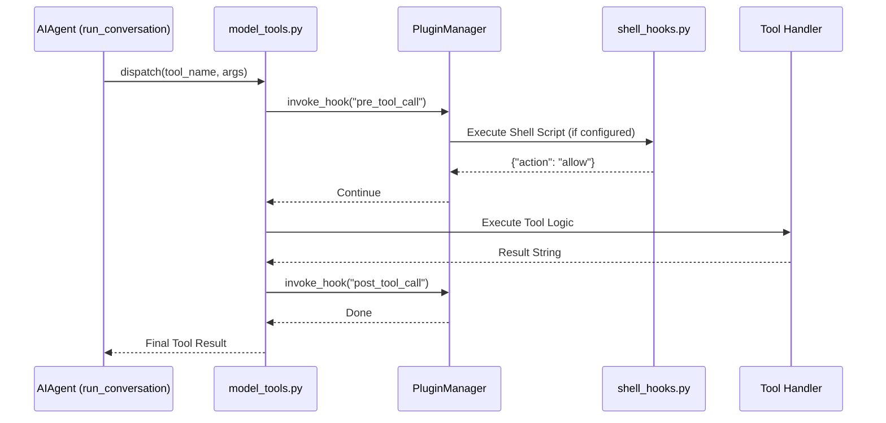
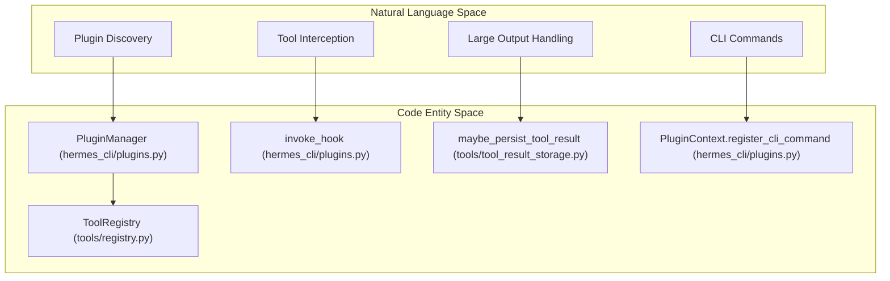

# Plugin Architecture & Hooks

Relevant source files

The following files were used as context for generating this wiki page:

- [agent/shell_hooks.py](../agent/shell_hooks.py)
- [agent/verify_hooks.py](../agent/verify_hooks.py)
- [docs/middleware/README.md](../docs/middleware/README.md)
- [gateway/builtin_hooks/__init__.py](../gateway/builtin_hooks/__init__.py)
- [gateway/hooks.py](../gateway/hooks.py)
- [hermes_cli/curses_ui.py](../hermes_cli/curses_ui.py)
- [hermes_cli/hooks.py](../hermes_cli/hooks.py)
- [hermes_cli/middleware.py](../hermes_cli/middleware.py)
- [hermes_cli/plugins.py](../hermes_cli/plugins.py)
- [hermes_cli/plugins_cmd.py](../hermes_cli/plugins_cmd.py)
- [hermes_cli/subcommands/acp.py](../hermes_cli/subcommands/acp.py)
- [hermes_cli/subcommands/claw.py](../hermes_cli/subcommands/claw.py)
- [hermes_cli/subcommands/insights.py](../hermes_cli/subcommands/insights.py)
- [hermes_cli/subcommands/memory.py](../hermes_cli/subcommands/memory.py)
- [hermes_cli/subcommands/pairing.py](../hermes_cli/subcommands/pairing.py)
- [hermes_cli/subcommands/plugins.py](../hermes_cli/subcommands/plugins.py)
- [hermes_cli/subcommands/skills.py](../hermes_cli/subcommands/skills.py)
- [hermes_cli/subcommands/tools.py](../hermes_cli/subcommands/tools.py)
- [tests/agent/test_shell_hooks.py](../tests/agent/test_shell_hooks.py)
- [tests/agent/test_shell_hooks_consent.py](../tests/agent/test_shell_hooks_consent.py)
- [tests/agent/test_subagent_stop_hook.py](../tests/agent/test_subagent_stop_hook.py)
- [tests/hermes_cli/test_curses_arrow_keys.py](../tests/hermes_cli/test_curses_arrow_keys.py)
- [tests/hermes_cli/test_curses_color_compat.py](../tests/hermes_cli/test_curses_color_compat.py)
- [tests/hermes_cli/test_curses_ui_search.py](../tests/hermes_cli/test_curses_ui_search.py)
- [tests/hermes_cli/test_plugins.py](../tests/hermes_cli/test_plugins.py)
- [tests/hermes_cli/test_plugins_cmd.py](../tests/hermes_cli/test_plugins_cmd.py)
- [tests/hermes_cli/test_plugins_cmd_enable_disable_nested.py](../tests/hermes_cli/test_plugins_cmd_enable_disable_nested.py)
- [tests/hermes_cli/test_plugins_cmd_list.py](../tests/hermes_cli/test_plugins_cmd_list.py)
- [tests/hermes_cli/test_setup_menu_curses_migration.py](../tests/hermes_cli/test_setup_menu_curses_migration.py)
- [tests/hermes_cli/test_subcommands_followup.py](../tests/hermes_cli/test_subcommands_followup.py)
- [tests/run_agent/test_concurrent_interrupt.py](../tests/run_agent/test_concurrent_interrupt.py)
- [tests/run_agent/test_image_rejection_fallback.py](../tests/run_agent/test_image_rejection_fallback.py)
- [tests/tools/test_approval_plugin_hooks.py](../tests/tools/test_approval_plugin_hooks.py)
- [tests/tools/test_local_tempdir.py](../tests/tools/test_local_tempdir.py)
- [tests/tools/test_registry.py](../tests/tools/test_registry.py)
- [tests/tools/test_tool_result_storage.py](../tests/tools/test_tool_result_storage.py)
- [tools/binary_extensions.py](../tools/binary_extensions.py)
- [tools/registry.py](../tools/registry.py)
- [tools/tool_result_storage.py](../tools/tool_result_storage.py)
- [web/src/pages/PluginsPage.tsx](../web/src/pages/PluginsPage.tsx)
- [website/docs/user-guide/features/hooks.md](../website/docs/user-guide/features/hooks.md)
- [website/docs/user-guide/features/plugins.md](../website/docs/user-guide/features/plugins.md)

Hermes Agent employs a multi-tiered extensibility architecture that allows developers to inject custom logic, tools, and platform integrations without modifying the core codebase. This is achieved through a unified `PluginManager` that handles discovery, registration, and lifecycle management across CLI and Gateway environments.

## 1. Plugin Discovery & Registration

The system discovers plugins from four distinct hierarchical sources. Later sources override earlier ones in the event of a name collision [hermes_cli/plugins.py:5-17](../hermes_cli/plugins.py#L5-L17).

| Source | Path | Description |
| :--- | :--- | :--- |
| **Bundled** | `<repo>/plugins/` | Shipped with the core distribution [hermes_cli/plugins.py:55-65](../hermes_cli/plugins.py#L55-L65). |
| **User** | `~/.hermes/plugins/` | Persistent user-installed plugins [hermes_cli/plugins.py:10](../hermes_cli/plugins.py#L10). |
| **Project** | `./.hermes/plugins/` | Opt-in via `HERMES_ENABLE_PROJECT_PLUGINS` [hermes_cli/plugins.py:11-12](../hermes_cli/plugins.py#L11-L12). |
| **Pip** | Entry Points | Packages exposing `hermes_agent.plugins` [hermes_cli/plugins.py:13-14](../hermes_cli/plugins.py#L13-L14). |

### The Manifest (plugin.yaml)
Each directory-based plugin must contain a `plugin.yaml` manifest. The manifest defines the plugin identity, version, and requirements [hermes_cli/plugins.py:19-20](../hermes_cli/plugins.py#L19-L20).
- **`name`**: Unique identifier.
- **`version`**: Semantic versioning.
- **`requires_env`**: List of environment variables (e.g., API keys) the plugin needs to function [website/docs/user-guide/features/plugins.md:108](../website/docs/user-guide/features/plugins.md#L108).

### Registration Lifecycle
Upon discovery, the `PluginManager` imports the plugin's `__init__.py` and calls a `register(ctx)` function [hermes_cli/plugins.py:19-20](../hermes_cli/plugins.py#L19-L20). The `PluginContext` (ctx) provides methods to register tools, hooks, and middleware [website/docs/user-guide/features/plugins.md:98-116](../website/docs/user-guide/features/plugins.md#L98-L116).

**Sources:** [hermes_cli/plugins.py:1-44](../hermes_cli/plugins.py#L1-L44), [website/docs/user-guide/features/plugins.md:118-130](../website/docs/user-guide/features/plugins.md#L118-L130)

---

## 2. Event Hooks System

Hermes supports three hook subsystems to intercept agent behavior at various lifecycle points.

### 2.1 Plugin Hooks (Python)
Registered via `ctx.register_hook(event_name, callback)`. These are synchronous or asynchronous Python functions that run within the agent process [website/docs/user-guide/features/hooks.md:14](../website/docs/user-guide/features/hooks.md#L14).

**Key Hook Points [hermes_cli/plugins.py:135-185](../hermes_cli/plugins.py#L135-L185):**
- `pre_tool_call` / `post_tool_call`: Intercept tool execution.
- `transform_tool_result`: Modify data returned from a tool before the LLM sees it.
- `transform_llm_output`: Post-process LLM text (e.g., for personality filters).
- `on_session_start` / `on_session_end`: Manage session-level resources.

### 2.2 Shell Hooks
Configured in `config.yaml` under the `hooks:` block, these allow external scripts to act as hooks [agent/shell_hooks.py:4-8](../agent/shell_hooks.py#L4-L8).
- **Protocol**: Hermes pipes a JSON payload to the script's `stdin` and reads a JSON response from `stdout` [agent/shell_hooks.py:30-45](../agent/shell_hooks.py#L30-L45).
- **Consent**: On first execution, Hermes prompts the user for consent, recording the approval in `shell-hooks-allowlist.json` [agent/shell_hooks.py:19-23](../agent/shell_hooks.py#L19-L23).

### 2.3 Gateway Hooks
Specific to the messaging gateway (Telegram, Discord, etc.), these use a `HOOK.yaml` and `handler.py` structure in `~/.hermes/hooks/` [website/docs/user-guide/features/hooks.md:25-32](../website/docs/user-guide/features/hooks.md#L25-L32).

### Hook Data Flow
The following diagram illustrates how a tool execution triggers various hook layers.

**Diagram: Tool Execution Hook Lifecycle**

**Sources:** [hermes_cli/plugins.py:135-185](../hermes_cli/plugins.py#L135-L185), [agent/shell_hooks.py:1-45](../agent/shell_hooks.py#L1-L45), [website/docs/user-guide/features/hooks.md:1-45](../website/docs/user-guide/features/hooks.md#L1-L45)

---

## 3. Middleware Layer

The middleware layer provides a "wrapper" pattern for core requests, specifically for LLM and Tool requests. Unlike hooks, which are event-driven observers, middleware is designed to transform request payloads before they reach the provider [hermes_cli/middleware.py:52-53](../hermes_cli/middleware.py#L52-L53).

### Valid Middleware Types [hermes_cli/plugins.py:135-185](../hermes_cli/plugins.py#L135-L185)
- `llm_request`: Intercepts messages sent to the LLM.
- `tool_request`: Intercepts arguments sent to a tool.
- `tool_execution`: Wraps the actual execution of the tool handler.

**Sources:** [hermes_cli/plugins.py:52-53](../hermes_cli/plugins.py#L52-L53), [tests/hermes_cli/test_plugins.py:107-134](../tests/hermes_cli/test_plugins.py#L107-L134)

---

## 4. Tool Result Storage & Budgeting

When tools produce large outputs (e.g., a massive log file), Hermes utilizes a 3-layer persistence strategy to prevent context window overflow [tools/tool_result_storage.py:1-24](../tools/tool_result_storage.py#L1-L24).

1. **Preview**: A truncated version of the result is shown to the LLM [tools/tool_result_storage.py:30-40](../tools/tool_result_storage.py#L30-L40).
2. **Persistence**: The full result is written to a local or remote sandbox directory (`hermes-results/`) [tools/tool_result_storage.py:84-98](../tools/tool_result_storage.py#L84-L98).
3. **Reference**: The LLM receives a "persisted output" tag containing a path or command to retrieve the full content if needed [tools/tool_result_storage.py:182-183](../tools/tool_result_storage.py#L182-L183).

### Implementation Details
- **`maybe_persist_tool_result`**: Determines if a result exceeds the character budget and triggers storage [tools/tool_result_storage.py:23](../tools/tool_result_storage.py#L23).
- **`_write_to_sandbox`**: Handles the physical writing of the file, ensuring shell metacharacters are neutralized to prevent injection [tools/tool_result_storage.py:139-156](../tools/tool_result_storage.py#L139-L156).

**Sources:** [tools/tool_result_storage.py:1-183](../tools/tool_result_storage.py#L1-L183), [tests/tools/test_tool_result_storage.py:84-158](../tests/tools/test_tool_result_storage.py#L84-L158)

---

## 5. CLI Management (hermes plugins)

The `hermes plugins` command group provides the interface for managing the plugin lifecycle [hermes_cli/plugins_cmd.py:1-8](../hermes_cli/plugins_cmd.py#L1-L8).

| Command | Function | Implementation |
| :--- | :--- | :--- |
| `list` | Displays installed and available plugins. | `_discover_all_plugins` |
| `install` | Clones a plugin from Git into `~/.hermes/plugins/`. | `_resolve_git_url` [hermes_cli/plugins_cmd.py:153-178](../hermes_cli/plugins_cmd.py#L153-L178) |
| `enable` / `disable` | Modifies `config.yaml` to toggle plugin loading. | `cfg_get` / `cfg_set` |

### Plugin Name Sanitization
To prevent path traversal attacks, the CLI validates plugin names using `_sanitize_plugin_name`, rejecting sequences like `..`, `/`, or `\` [hermes_cli/plugins_cmd.py:82-136](../hermes_cli/plugins_cmd.py#L82-L136).

**Sources:** [hermes_cli/plugins_cmd.py:1-178](../hermes_cli/plugins_cmd.py#L1-L178), [hermes_cli/subcommands/plugins.py:1-50](../hermes_cli/subcommands/plugins.py#L1-L50)

---

## 6. Architecture Entity Mapping

The following diagram maps high-level concepts to the specific code entities responsible for their implementation.

**Diagram: Entity Mapping**

**Sources:** [hermes_cli/plugins.py:1-45](../hermes_cli/plugins.py#L1-L45), [tools/tool_result_storage.py:23](../tools/tool_result_storage.py#L23), [tools/registry.py:87-118](../tools/registry.py#L87-L118)

---
