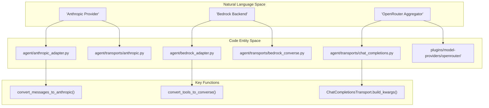
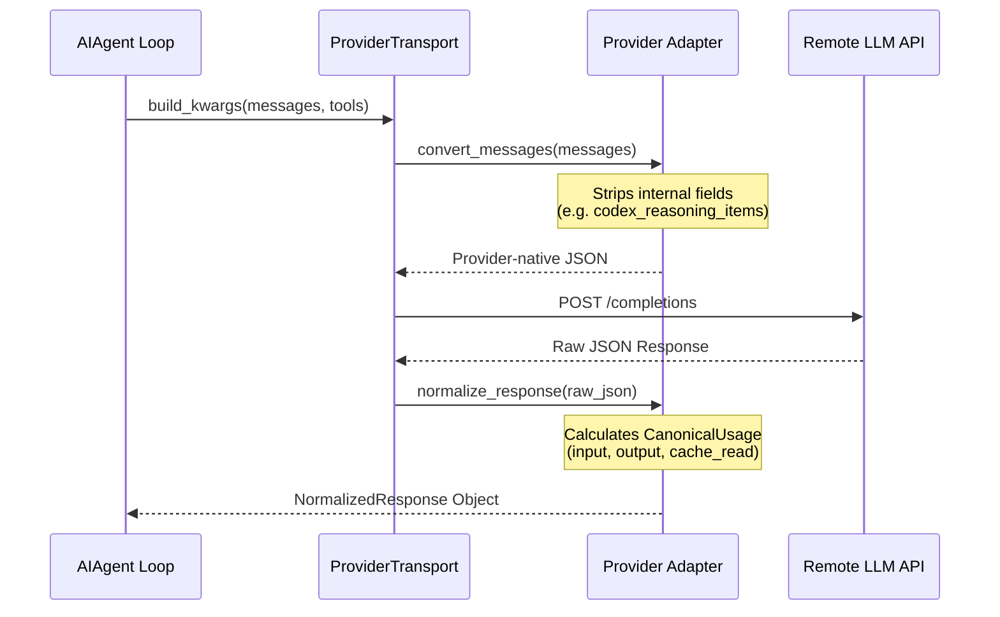

# Model Provider Plugins

Relevant source files

The following files were used as context for generating this wiki page:

- [agent/anthropic_adapter.py](../agent/anthropic_adapter.py)
- [agent/bedrock_adapter.py](../agent/bedrock_adapter.py)
- [agent/codex_runtime.py](../agent/codex_runtime.py)
- [agent/message_sanitization.py](../agent/message_sanitization.py)
- [agent/portal_tags.py](../agent/portal_tags.py)
- [agent/prompt_caching.py](../agent/prompt_caching.py)
- [agent/transports/__init__.py](../agent/transports/__init__.py)
- [agent/transports/anthropic.py](../agent/transports/anthropic.py)
- [agent/transports/chat_completions.py](../agent/transports/chat_completions.py)
- [agent/transports/codex_app_server_session.py](../agent/transports/codex_app_server_session.py)
- [agent/transports/types.py](../agent/transports/types.py)
- [agent/usage_pricing.py](../agent/usage_pricing.py)
- [hermes_cli/model_setup_flows.py](../hermes_cli/model_setup_flows.py)
- [plugins/model-providers/minimax/__init__.py](../plugins/model-providers/minimax/__init__.py)
- [plugins/model-providers/nous/__init__.py](../plugins/model-providers/nous/__init__.py)
- [plugins/model-providers/openrouter/__init__.py](../plugins/model-providers/openrouter/__init__.py)
- [tests/agent/test_anthropic_adapter.py](../tests/agent/test_anthropic_adapter.py)
- [tests/agent/test_anthropic_mcp_prefix_strip.py](../tests/agent/test_anthropic_mcp_prefix_strip.py)
- [tests/agent/test_anthropic_oauth_ua_prefix.py](../tests/agent/test_anthropic_oauth_ua_prefix.py)
- [tests/agent/test_anthropic_output_field_leak.py](../tests/agent/test_anthropic_output_field_leak.py)
- [tests/agent/test_bedrock_adapter.py](../tests/agent/test_bedrock_adapter.py)
- [tests/agent/test_bedrock_integration.py](../tests/agent/test_bedrock_integration.py)
- [tests/agent/test_bedrock_interrupt_post_worker.py](../tests/agent/test_bedrock_interrupt_post_worker.py)
- [tests/agent/test_close_interrupted_tool_sequence.py](../tests/agent/test_close_interrupted_tool_sequence.py)
- [tests/agent/test_codex_app_server_event_bridge.py](../tests/agent/test_codex_app_server_event_bridge.py)
- [tests/agent/test_codex_app_server_persist.py](../tests/agent/test_codex_app_server_persist.py)
- [tests/agent/test_minimax_provider.py](../tests/agent/test_minimax_provider.py)
- [tests/agent/test_portal_tags.py](../tests/agent/test_portal_tags.py)
- [tests/agent/test_prompt_caching.py](../tests/agent/test_prompt_caching.py)
- [tests/agent/test_usage_pricing.py](../tests/agent/test_usage_pricing.py)
- [tests/agent/transports/test_chat_completions.py](../tests/agent/transports/test_chat_completions.py)
- [tests/agent/transports/test_codex_app_server_session.py](../tests/agent/transports/test_codex_app_server_session.py)
- [tests/agent/transports/test_transport.py](../tests/agent/transports/test_transport.py)
- [tests/agent/transports/test_types.py](../tests/agent/transports/test_types.py)
- [tests/cli/test_cli_provider_resolution.py](../tests/cli/test_cli_provider_resolution.py)
- [tests/gateway/test_dingtalk.py](../tests/gateway/test_dingtalk.py)
- [tests/gateway/test_feishu_bot_admission.py](../tests/gateway/test_feishu_bot_admission.py)
- [tests/hermes_cli/test_bedrock_model_picker.py](../tests/hermes_cli/test_bedrock_model_picker.py)
- [tests/hermes_cli/test_bedrock_region_scoped_picker.py](../tests/hermes_cli/test_bedrock_region_scoped_picker.py)
- [tests/hermes_cli/test_custom_provider_model_switch.py](../tests/hermes_cli/test_custom_provider_model_switch.py)
- [tests/hermes_cli/test_gpt56_registration.py](../tests/hermes_cli/test_gpt56_registration.py)
- [tests/hermes_cli/test_model_provider_persistence.py](../tests/hermes_cli/test_model_provider_persistence.py)
- [tests/hermes_cli/test_reasoning_effort_menu.py](../tests/hermes_cli/test_reasoning_effort_menu.py)
- [tests/hermes_cli/test_terminal_menu_fallbacks.py](../tests/hermes_cli/test_terminal_menu_fallbacks.py)
- [tests/hermes_state/test_conversation_root.py](../tests/hermes_state/test_conversation_root.py)
- [tests/plugins/model_providers/test_minimax_profile.py](../tests/plugins/model_providers/test_minimax_profile.py)
- [tests/providers/test_profile_wiring.py](../tests/providers/test_profile_wiring.py)
- [tests/providers/test_provider_profiles.py](../tests/providers/test_provider_profiles.py)
- [tests/providers/test_transport_parity.py](../tests/providers/test_transport_parity.py)
- [tests/run_agent/test_anthropic_prompt_cache_policy.py](../tests/run_agent/test_anthropic_prompt_cache_policy.py)
- [tests/run_agent/test_anthropic_truncation_continuation.py](../tests/run_agent/test_anthropic_truncation_continuation.py)
- [tests/run_agent/test_codex_app_server_integration.py](../tests/run_agent/test_codex_app_server_integration.py)
- [tests/run_agent/test_provider_parity.py](../tests/run_agent/test_provider_parity.py)
- [tests/run_agent/test_repair_tool_call_arguments.py](../tests/run_agent/test_repair_tool_call_arguments.py)
- [tests/run_agent/test_stream_single_writer_65991.py](../tests/run_agent/test_stream_single_writer_65991.py)
- [tests/run_agent/test_streaming.py](../tests/run_agent/test_streaming.py)
- [tests/test_minisweagent_path.py](../tests/test_minisweagent_path.py)
- [tests/tools/test_terminal_requirements.py](../tests/tools/test_terminal_requirements.py)
- [tests/tools/test_terminal_tool_requirements.py](../tests/tools/test_terminal_tool_requirements.py)
- [tests/tools/test_tts_kittentts.py](../tests/tools/test_tts_kittentts.py)
- [website/docs/developer-guide/adding-providers.md](../website/docs/developer-guide/adding-providers.md)
- [website/docs/developer-guide/model-provider-plugin.md](../website/docs/developer-guide/model-provider-plugin.md)
- [website/docs/user-guide/features/provider-routing.md](../website/docs/user-guide/features/provider-routing.md)

The Model Provider Plugin system allows Hermes Agent to interface with over 30 different LLM backends through a unified contract. These plugins handle the translation between Hermes' internal OpenAI-style message format and provider-specific wire protocols, manage authentication flows (API keys, OAuth, AWS IAM), and perform model metadata discovery.

## Provider Architecture

The system is built around the `ProviderProfile` and `ProviderTransport` abstractions. While the core agent logic operates on a standard schema, the provider layer isolates the complexity of vendor-specific quirks, such as Anthropic's adaptive thinking or Gemini's thought signatures.

### Natural Language to Code Entity Mapping

The following diagram illustrates how high-level provider concepts map to specific implementation entities in the codebase.

**Provider Entity Map**

**Sources:** [agent/anthropic_adapter.py:1-11](../agent/anthropic_adapter.py#L1-L11), [agent/bedrock_adapter.py:1-28](../agent/bedrock_adapter.py#L1-L28), [agent/transports/chat_completions.py:1-10](../agent/transports/chat_completions.py#L1-L10)

---

## The Provider Contract

Every provider is defined by a profile and an associated transport mode. The transport dictates how messages are prepared and how responses are parsed.

### Key Provider Hooks

1.  **`prepare_messages` / `convert_messages`**: Translates the standard Hermes message list into the provider's format. For example, stripping internal metadata like `tool_name` or `timestamp` that strict providers (e.g., Mistral, Fireworks) reject with HTTP 400 [agent/transports/chat_completions.py:141-160](../agent/transports/chat_completions.py#L141-L160), [tests/agent/transports/test_chat_completions.py:117-130](../tests/agent/transports/test_chat_completions.py#L117-L130).
2.  **`build_extra_body` / `build_kwargs`**: Assembles the JSON payload for the API request. This includes setting `max_tokens`, `temperature`, and provider-specific features like `reasoning_effort` [agent/transports/chat_completions.py:21-33](../agent/transports/chat_completions.py#L21-L33).
3.  **`fetch_models`**: Discovers available models. For AWS Bedrock, this involves querying the control plane for foundation models and cross-region inference profiles [agent/bedrock_adapter.py:11-17](../agent/bedrock_adapter.py#L11-L17).

### Data Flow: Message Normalization

**Sources:** [agent/transports/chat_completions.py:141-158](../agent/transports/chat_completions.py#L141-L158), [agent/usage_pricing.py:31-38](../agent/usage_pricing.py#L31-L38), [agent/codex_runtime.py:100-120](../agent/codex_runtime.py#L100-L120)

---

## Supported Providers & Implementations

Hermes bundles adapters for major LLM ecosystems, each handling unique protocol requirements.

| Provider | Implementation Path | Key Features |
| :--- | :--- | :--- |
| **Anthropic** | `agent/anthropic_adapter.py` | Adaptive thinking (4.6+), Prompt Caching, OAuth tokens [agent/anthropic_adapter.py:77-90](../agent/anthropic_adapter.py#L77-L90) |
| **AWS Bedrock** | `agent/bedrock_adapter.py` | Converse API, IAM auth, Cross-region profiles [agent/bedrock_adapter.py:7-17](../agent/bedrock_adapter.py#L7-L17) |
| **Gemini** | `agent/transports/chat_completions.py` | Thought signatures replayed via `extra_content` [agent/transports/chat_completions.py:115-128](../agent/transports/chat_completions.py#L115-L128) |
| **OpenRouter** | `agent/transports/chat_completions.py` | Unified Chat Completions, dynamic pricing fetch [agent/usage_pricing.py:168-180](../agent/usage_pricing.py#L168-L180) |
| **DeepSeek** | `agent/usage_pricing.py` | Native cache hit reporting (`prompt_cache_hit_tokens`) [agent/usage_pricing.py:63-75](../agent/usage_pricing.py#L63-L75) |
| **Codex** | `agent/codex_runtime.py` | App Server subprocess, Responses API streaming [agent/codex_runtime.py:8-15](../agent/codex_runtime.py#L8-L15) |

### Anthropic Adaptive Thinking
For Anthropic models, the adapter maps Hermes' internal effort levels (e.g., `ultra`, `xhigh`) to the provider's `output_config.effort` levels (`max`, `high`, etc.). It also manages the transition from legacy manual `thinking` blocks to the modern adaptive contract used in Claude 4.7+ [agent/anthropic_adapter.py:58-75](../agent/anthropic_adapter.py#L58-L75), [agent/anthropic_adapter.py:108-114](../agent/anthropic_adapter.py#L108-L114).

### AWS Bedrock Converse API
The Bedrock adapter uses `boto3` to call the `converse` and `converse_stream` actions. It includes a stale-connection detection mechanism that evicts cached clients if a `ConnectionClosedError` occurs, ensuring high reliability in long-running agent sessions [agent/bedrock_adapter.py:155-174](../agent/bedrock_adapter.py#L155-L174).

---

## Token Accounting & Pricing

The `agent/usage_pricing.py` module provides a `CanonicalUsage` class to normalize token counts across providers.

*   **Cache Normalization**: The system differentiates between `cache_read_tokens` and `cache_write_tokens`. For OpenAI, it parses `prompt_tokens_details.cached_tokens`; for Anthropic, it reads `cache_read_input_tokens` [agent/usage_pricing.py:31-42](../agent/usage_pricing.py#L31-L42), [tests/agent/test_usage_pricing.py:11-25](../tests/agent/test_usage_pricing.py#L11-L25).
*   **Cost Estimation**: Uses `PricingEntry` snapshots and live metadata from `models.dev` to estimate the USD cost of each turn [agent/usage_pricing.py:89-98](../agent/usage_pricing.py#L89-L98), [agent/usage_pricing.py:105-120](../agent/usage_pricing.py#L105-L120).

**Sources:** [agent/usage_pricing.py:31-98](../agent/usage_pricing.py#L31-L98), [tests/agent/test_usage_pricing.py:11-60](../tests/agent/test_usage_pricing.py#L11-L60)

---

## Adding a New Provider

To add a new provider, a developer typically follows these steps:

1.  **Define a Profile**: Create a new directory in `plugins/model-providers/` with an `__init__.py` defining the `ProviderProfile`.
2.  **Implement Transport**: If the provider is not OpenAI-compatible, implement a new class inheriting from `ProviderTransport` in `agent/transports/`.
3.  **Register Auth Flow**: Add a corresponding `_model_flow_*` function in `hermes_cli/model_setup_flows.py` to handle interactive credential setup [hermes_cli/model_setup_flows.py:1-12](../hermes_cli/model_setup_flows.py#L1-L12).
4.  **Add Normalization Logic**: Ensure `agent/usage_pricing.py` can correctly parse the provider's token usage response [agent/usage_pricing.py:7-10](../agent/usage_pricing.py#L7-L10).

**Sources:** [hermes_cli/model_setup_flows.py:1-19](../hermes_cli/model_setup_flows.py#L1-L19), [agent/transports/base.py](../agent/transports/base.py), [agent/usage_pricing.py:1-10](../agent/usage_pricing.py#L1-L10)

---
