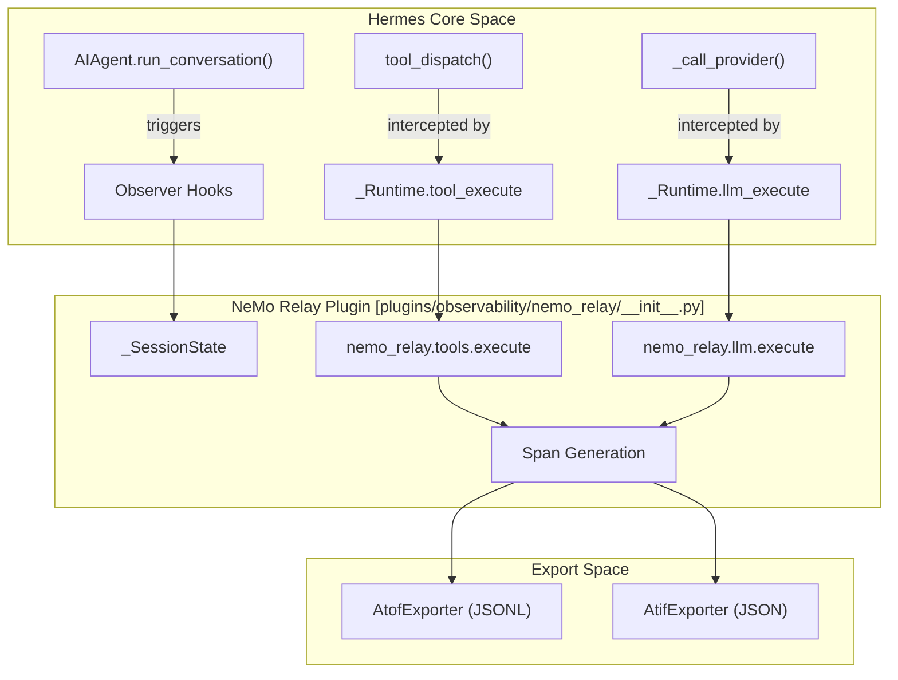
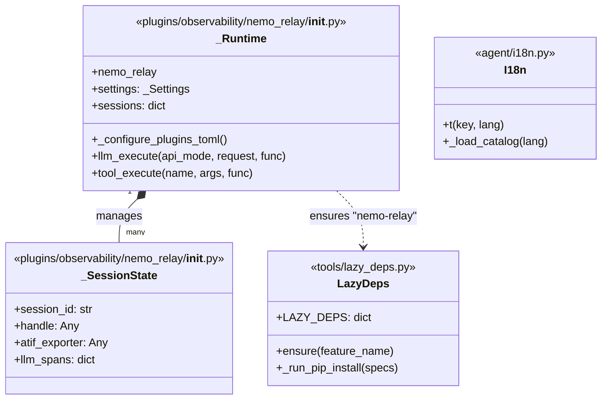

# Observability & NeMo Relay

Relevant source files

The following files were used as context for generating this wiki page:

- [agent/i18n.py](../agent/i18n.py)
- [hermes_cli/__init__.py](../hermes_cli/__init__.py)
- [optional-mcps/unreal-engine/manifest.yaml](../optional-mcps/unreal-engine/manifest.yaml)
- [plugins/observability/nemo_relay/README.md](../plugins/observability/nemo_relay/README.md)
- [plugins/observability/nemo_relay/__init__.py](../plugins/observability/nemo_relay/__init__.py)
- [pyproject.toml](../pyproject.toml)
- [scripts/contributor_audit.py](../scripts/contributor_audit.py)
- [scripts/release.py](../scripts/release.py)
- [tests/agent/test_i18n.py](../tests/agent/test_i18n.py)
- [tests/hermes_cli/test_ensure_utf8_locale.py](../tests/hermes_cli/test_ensure_utf8_locale.py)
- [tests/plugins/test_nemo_relay_plugin.py](../tests/plugins/test_nemo_relay_plugin.py)
- [tests/test_packaging_metadata.py](../tests/test_packaging_metadata.py)
- [tests/test_project_metadata.py](../tests/test_project_metadata.py)
- [tests/tools/test_lazy_deps.py](../tests/tools/test_lazy_deps.py)
- [tools/lazy_deps.py](../tools/lazy_deps.py)
- [uv.lock](../uv.lock)

Hermes Agent provides a multi-layered observability stack designed for high-fidelity execution tracking, trajectory analysis, and secure dependency management. This system integrates NVIDIA's **NeMo Relay** for runtime lifecycle events and **Langfuse** for tracing, supported by a specialized **Lazy Dependency** system that ensures supply-chain security and minimal install bloat.

## NeMo Relay Integration

The NeMo Relay plugin maps Hermes internal observer hooks to the NeMo Relay runtime model, enabling standardized event emission for sessions, turns, tool execution, and LLM calls [plugins/observability/nemo_relay/README.md:3-10](../plugins/observability/nemo_relay/README.md#L3-L10).

### Trajectory Formats
The plugin supports two primary NVIDIA-canonical formats for agent work:
*   **ATOF (Agent Trajectory Observability Format):** A raw JSONL event stream representation of lifecycle events used for debugging [plugins/observability/nemo_relay/README.md:26-29](../plugins/observability/nemo_relay/README.md#L26-L29).
*   **ATIF (Agent Trajectory Interchange Format):** A structured trajectory representation (v1.7) for complex harness workflows, supporting subagent embedding and multi-LLM step metadata [plugins/observability/nemo_relay/README.md:30-35](../plugins/observability/nemo_relay/README.md#L30-L35).

### Managed Execution Intercepts
When the `adaptive` component is enabled in `plugins.toml`, the plugin transitions from passive observation to managed execution [plugins/observability/nemo_relay/README.md:173-183](../plugins/observability/nemo_relay/README.md#L173-L183). It routes calls through `nemo_relay.llm.execute` and `nemo_relay.tools.execute`, allowing the Relay runtime to manage the execution boundary [plugins/observability/nemo_relay/__init__.py:75-93](../plugins/observability/nemo_relay/__init__.py#L75-L93).

### Subagent Correlation
The system tracks parent-child relationships between agents. When a `delegate_tool` spawns a subagent, the plugin correlates the parent `session_id` with the child, preserving the execution tree in the exported trajectories [plugins/observability/nemo_relay/README.md:20-22](../plugins/observability/nemo_relay/README.md#L20-L22), [plugins/observability/nemo_relay/__init__.py:43-48](../plugins/observability/nemo_relay/__init__.py#L43-L48).

### Data Flow: Observability Intercepts

The following diagram illustrates how the `nemo_relay` plugin intercepts Hermes core operations to generate observability data.

**Diagram: Hermes to NeMo Relay Event Flow**

Sources: [plugins/observability/nemo_relay/__init__.py:69-83](../plugins/observability/nemo_relay/__init__.py#L69-L83), [plugins/observability/nemo_relay/README.md:173-191](../plugins/observability/nemo_relay/README.md#L173-L191)

## Lazy Dependency System

Hermes uses a "Lazy Install" pattern to handle optional features (e.g., specific model providers like `anthropic` or search tools like `firecrawl`) without bloating the core installation [tools/lazy_deps.py:4-17](../tools/lazy_deps.py#L4-L17).

### Security & Supply Chain Protection
The system implements several layers of protection against supply-chain attacks:
*   **Exact Pinning:** All dependencies in `pyproject.toml` and `LAZY_DEPS` are exact-pinned (e.g., `openai==2.24.0`) to prevent silent upgrades to compromised versions [pyproject.toml:20-28](../pyproject.toml#L20-L28), [tools/lazy_deps.py:120-122](../tools/lazy_deps.py#L120-L122).
*   **LAZY_DEPS Allowlist:** Only packages explicitly listed in the `LAZY_DEPS` dictionary can be installed at runtime. This prevents arbitrary package installation via malicious configuration [tools/lazy_deps.py:48-50](../tools/lazy_deps.py#L48-L50), [tools/lazy_deps.py:97-150](../tools/lazy_deps.py#L97-L150).
*   **Venv Isolation:** Installs are scoped to the active virtual environment or a dedicated `HERMES_LAZY_INSTALL_TARGET` [tools/lazy_deps.py:27-33](../tools/lazy_deps.py#L27-L33).
*   **Shadowing Protection:** Lazily installed packages are appended to `sys.path`, ensuring they can never shadow or downgrade core modules [tools/lazy_deps.py:34-38](../tools/lazy_deps.py#L34-L38).

### Lazy Dependency Registry
The `LAZY_DEPS` map in `tools/lazy_deps.py` serves as the source of truth for optional packages:

| Feature Namespace | Package Specs | Rationale |
| :--- | :--- | :--- |
| `provider.anthropic` | `anthropic==0.87.0` | Native SDK for direct Anthropic calls [tools/lazy_deps.py:101](../tools/lazy_deps.py#L101) |
| `search.firecrawl` | `firecrawl-py==4.17.0` | Web extraction backend [tools/lazy_deps.py:116](../tools/lazy_deps.py#L116) |
| `memory.honcho` | `honcho-ai==2.2.0` | External memory provider [tools/lazy_deps.py:144](../tools/lazy_deps.py#L144) |
| `platform.slack` | `slack-sdk==3.33.3`, `aiohttp==3.14.1` | Messaging gateway adapter [tools/lazy_deps.py:165](../tools/lazy_deps.py#L165) |

Sources: [tools/lazy_deps.py:97-170](../tools/lazy_deps.py#L97-L170), [pyproject.toml:20-39](../pyproject.toml#L20-L39)

## Implementation Details

### Dependency Consistency Enforcement
To prevent version drift, the test suite enforces that pins in `pyproject.toml` match those in `tools/lazy_deps.py`. If a package like `aiohttp` is updated for a CVE in one location, the test `test_pyproject_pins_match_lazy_deps_pins` fails until both are aligned [tests/test_project_metadata.py:131-175](../tests/test_project_metadata.py#L131-L175).

### Stdio & Environment Bootstrap
The CLI ensures a stable environment for observability by forcing UTF-8 encoding for `stdout`/`stderr` during the `_ensure_utf8` bootstrap phase [hermes_cli/__init__.py:21-51](../hermes_cli/__init__.py#L21-L51). This prevents crashes when the agent emits complex trajectory metadata or box-drawing characters in terminals with legacy locales [hermes_cli/__init__.py:31-34](../hermes_cli/__init__.py#L31-L34).

### Code Entity Mapping: Observability Runtime

The following diagram maps the logical observability concepts to the specific Python classes and functions in the codebase.

**Diagram: Observability Code Entities**

Sources: [plugins/observability/nemo_relay/__init__.py:31-40](../plugins/observability/nemo_relay/__init__.py#L31-L40), [plugins/observability/nemo_relay/__init__.py:69-83](../plugins/observability/nemo_relay/__init__.py#L69-L83), [tools/lazy_deps.py:97-100](../tools/lazy_deps.py#L97-L100), [agent/i18n.py:17-29](../agent/i18n.py#L17-L29)

---
