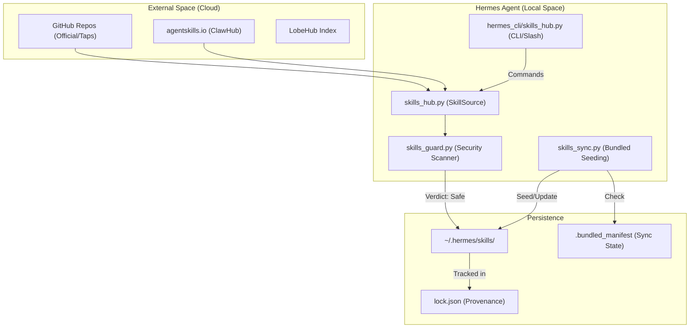
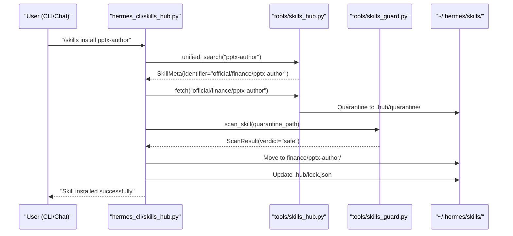

# Skills Hub & Distribution

Relevant source files

The following files were used as context for generating this wiki page:

- [hermes_cli/skills_hub.py](../hermes_cli/skills_hub.py)
- [optional-skills/mlops/models/segment-anything/SKILL.md](../optional-skills/mlops/models/segment-anything/SKILL.md)
- [optional-skills/mlops/models/segment-anything/references/advanced-usage.md](../optional-skills/mlops/models/segment-anything/references/advanced-usage.md)
- [optional-skills/mlops/models/segment-anything/references/troubleshooting.md](../optional-skills/mlops/models/segment-anything/references/troubleshooting.md)
- [optional-skills/yuanbao/SKILL.md](../optional-skills/yuanbao/SKILL.md)
- [scripts/build_skills_index.py](../scripts/build_skills_index.py)
- [skills/autonomous-ai-agents/computer-use/SKILL.md](../skills/autonomous-ai-agents/computer-use/SKILL.md)
- [skills/software-development/simplify-code/SKILL.md](../skills/software-development/simplify-code/SKILL.md)
- [tests/hermes_cli/test_skills_hub.py](../tests/hermes_cli/test_skills_hub.py)
- [tests/scripts/test_build_skills_index_health.py](../tests/scripts/test_build_skills_index_health.py)
- [tests/tools/test_force_dangerous_override.py](../tests/tools/test_force_dangerous_override.py)
- [tests/tools/test_skills_guard.py](../tests/tools/test_skills_guard.py)
- [tests/tools/test_skills_hub.py](../tests/tools/test_skills_hub.py)
- [tests/tools/test_skills_hub_clawhub.py](../tests/tools/test_skills_hub_clawhub.py)
- [tests/tools/test_skills_sync.py](../tests/tools/test_skills_sync.py)
- [tests/website/__init__.py](../tests/website/__init__.py)
- [tests/website/test_extract_skills.py](../tests/website/test_extract_skills.py)
- [tests/website/test_generate_skill_docs.py](../tests/website/test_generate_skill_docs.py)
- [tools/skills_guard.py](../tools/skills_guard.py)
- [tools/skills_hub.py](../tools/skills_hub.py)
- [tools/skills_sync.py](../tools/skills_sync.py)
- [website/docs/reference/optional-skills-catalog.md](../website/docs/reference/optional-skills-catalog.md)
- [website/docs/reference/skills-catalog.md](../website/docs/reference/skills-catalog.md)
- [website/docs/user-guide/features/computer-use.md](../website/docs/user-guide/features/computer-use.md)
- [website/docs/user-guide/skills/bundled/autonomous-ai-agents/autonomous-ai-agents-computer-use.md](../website/docs/user-guide/skills/bundled/autonomous-ai-agents/autonomous-ai-agents-computer-use.md)
- [website/docs/user-guide/skills/bundled/software-development/software-development-simplify-code.md](../website/docs/user-guide/skills/bundled/software-development/software-development-simplify-code.md)
- [website/docs/user-guide/skills/optional/mlops/mlops-models-segment-anything.md](../website/docs/user-guide/skills/optional/mlops/mlops-models-segment-anything.md)
- [website/docs/user-guide/skills/optional/yuanbao/yuanbao-yuanbao.md](../website/docs/user-guide/skills/optional/yuanbao/yuanbao-yuanbao.md)
- [website/i18n/zh-Hans/docusaurus-plugin-content-docs/current/reference/optional-skills-catalog.md](../website/i18n/zh-Hans/docusaurus-plugin-content-docs/current/reference/optional-skills-catalog.md)
- [website/i18n/zh-Hans/docusaurus-plugin-content-docs/current/reference/skills-catalog.md](../website/i18n/zh-Hans/docusaurus-plugin-content-docs/current/reference/skills-catalog.md)
- [website/i18n/zh-Hans/docusaurus-plugin-content-docs/current/user-guide/features/skills.md](../website/i18n/zh-Hans/docusaurus-plugin-content-docs/current/user-guide/features/skills.md)
- [website/i18n/zh-Hans/docusaurus-plugin-content-docs/current/user-guide/skills/optional/mlops/mlops-models-segment-anything.md](../website/i18n/zh-Hans/docusaurus-plugin-content-docs/current/user-guide/skills/optional/mlops/mlops-models-segment-anything.md)
- [website/i18n/zh-Hans/docusaurus-plugin-content-docs/current/user-guide/skills/optional/yuanbao/yuanbao-yuanbao.md](../website/i18n/zh-Hans/docusaurus-plugin-content-docs/current/user-guide/skills/optional/yuanbao/yuanbao-yuanbao.md)
- [website/scripts/extract-skills.py](../website/scripts/extract-skills.py)
- [website/scripts/generate-skill-docs.py](../website/scripts/generate-skill-docs.py)
- [website/scripts/prebuild.mjs](../website/scripts/prebuild.mjs)
- [website/sidebars.ts](../website/sidebars.ts)
- [website/src/pages/skills/index.tsx](../website/src/pages/skills/index.tsx)
- [website/src/pages/skills/styles.module.css](../website/src/pages/skills/styles.module.css)

The Skills Hub is a decentralized distribution system for Hermes Agent procedural memory (Skills). It enables the discovery, installation, and synchronization of skills from official repositories, community taps, and third-party registries like [agentskills.io](https://agentskills.io). The system is governed by a security-first architecture that validates external code before it reaches the user's execution environment.

## Architecture Overview

The distribution pipeline consists of three primary layers:
1.  **Discovery & Sources**: Adapters for fetching skill bundles from GitHub, LobeHub, or local catalogs.
2.  **Security Gate (Skills Guard)**: A static analysis engine that scans for exfiltration, destructive commands, and prompt injection.
3.  **Lifecycle Management**: Syncing bundled skills, tracking provenance via lockfiles, and managing per-profile skill isolation.

### Component Relationship Diagram

Sources: [tools/skills_hub.py:1-14](../tools/skills_hub.py#L1-L14), [tools/skills_guard.py:1-10](../tools/skills_guard.py#L1-L10), [tools/skills_sync.py:1-22](../tools/skills_sync.py#L1-L22)

---

## Skills Hub (skills_hub.py)

The `skills_hub.py` module provides the core logic for interacting with skill registries. It uses a provider-based architecture defined by the `SkillSource` abstract base class [tools/skills_hub.py:24-42](../tools/skills_hub.py#L24-L42).

### Key Source Adapters
*   **OptionalSkillSource**: Manages official "optional-skills" shipped with the repository but not active by default [tools/skills_hub.py:8-9](../tools/skills_hub.py#L8-L9).
*   **GitHubSource**: Fetches skills from any GitHub repository using the Contents API. It supports "taps" (third-party repositories added by the user) [tools/skills_hub.py:9-10](../tools/skills_hub.py#L9-L10).
*   **ClawHubSource**: Adapter for the `agentskills.io` registry, allowing discovery of community-contributed skills.
*   **UrlSource**: Allows direct installation of a skill from a single `SKILL.md` URL or a ZIP archive.

### Provenance Tracking
Installed hub skills are tracked in `~/.hermes/skills/.hub/lock.json`. This `HubLockFile` stores:
*   The original source identifier (e.g., `openai/skills/web-search`).
*   The content hash of the files at the time of installation.
*   The trust level and installation timestamp [tools/skills_hub.py:10-11](../tools/skills_hub.py#L10-L11).

Sources: [tools/skills_hub.py:5-14](../tools/skills_hub.py#L5-L14), [tools/skills_hub.py:130-153](../tools/skills_hub.py#L130-L153)

---

## Security Validation (Skills Guard)

Before any skill is moved from the `quarantine` directory to the active `skills/` directory, it must pass the `skills_guard.py` scanner.

### Trust Levels & Policy
The system enforces a tiered trust model [tools/skills_guard.py:44-65](../tools/skills_guard.py#L44-L65):

| Trust Level | Sources | Policy |
| :--- | :--- | :--- |
| `builtin` | Shipped with Hermes core | Always allowed. |
| `trusted` | `openai/skills`, `anthropics/skills`, `NVIDIA/skills` | Allowed if verdict is `safe` or `caution`. |
| `community` | Everything else (ClawHub, Taps) | Blocked if any `caution` or `dangerous` findings. |

### Threat Detection
The scanner uses `THREAT_PATTERNS` (regex-based static analysis) to detect [tools/skills_guard.py:101-200](../tools/skills_guard.py#L101-L200):
*   **Exfiltration**: `curl` or `fetch` calls interpolating environment variables like `API_KEY` or `SECRET`.
*   **Credential Access**: Attempts to read `~/.ssh`, `~/.aws`, or `.env` files.
*   **Destructive Commands**: `rm -rf /`, `mkfs`, or raw disk access.
*   **Persistence**: Modifications to `.bashrc`, `crontab`, or systemd services.

Sources: [tools/skills_guard.py:11-23](../tools/skills_guard.py#L11-L23), [tools/skills_guard.py:44-65](../tools/skills_guard.py#L44-L65), [tools/skills_guard.py:101-168](../tools/skills_guard.py#L101-L168)

---

## Bundled Skills Sync (skills_sync.py)

Hermes ships with a large library of "Bundled Skills" (e.g., `apple-notes`, `github-pr-workflow`). These are seeded into the user's profile on first run and kept up to date via `skills_sync.py`.

### Sync Logic (v2)
The sync process uses a manifest (`~/.hermes/skills/.bundled_manifest`) to track the state of bundled skills [tools/skills_sync.py:8-22](../tools/skills_sync.py#L8-L22):

1.  **New Skills**: If a skill exists in the repo but not in the manifest, it is copied to the user's directory.
2.  **Existing Skills**:
    *   If the user's copy matches the `origin_hash` in the manifest, it is considered **unmodified** and is safely updated if the repo version changes [tools/skills_sync.py:14-16](../tools/skills_sync.py#L14-L16).
    *   If the hashes differ, the user has **customized** the skill; the sync skips this skill to prevent overwriting user changes [tools/skills_sync.py:17-17](../tools/skills_sync.py#L17).
3.  **Deletions**: If a skill is in the manifest but missing from the user's directory, it is assumed the user **deleted** it intentionally. It will not be re-seeded [tools/skills_sync.py:18-18](../tools/skills_sync.py#L18).

Sources: [tools/skills_sync.py:1-22](../tools/skills_sync.py#L1-L22), [tools/skills_sync.py:41-50](../tools/skills_sync.py#L41-L50), [tools/skills_sync.py:111-118](../tools/skills_sync.py#L111-L118)

---

## User Interaction Space

Users interact with the distribution system through the CLI or interactive slash commands.

### Code-to-Natural-Language Mapping

### CLI Command Reference
*   `hermes skills search <query>`: Performs a `parallel_search_sources` across all active taps and registries [hermes_cli/skills_hub.py:56-61](../hermes_cli/skills_hub.py#L56-L61).
*   `hermes skills install <identifier>`: Resolves the source, downloads the bundle, and runs the `skills_guard` scan [hermes_cli/skills_hub.py:126-153](../hermes_cli/skills_hub.py#L126-L153).
*   `hermes skills update`: Checks for updates to both hub-installed skills and bundled skills [hermes_cli/skills_hub.py:83-98](../hermes_cli/skills_hub.py#L83-L98).
*   `hermes skills list`: Displays all installed skills, categorized by source (`hub`, `builtin`, or `local`) and their current status (enabled/disabled) [hermes_cli/skills_hub.py:157-168](../hermes_cli/skills_hub.py#L157-L168).

Sources: [hermes_cli/skills_hub.py:1-11](../hermes_cli/skills_hub.py#L1-L11), [hermes_cli/skills_hub.py:49-61](../hermes_cli/skills_hub.py#L49-L61), [hermes_cli/skills_hub.py:126-153](../hermes_cli/skills_hub.py#L126-L153)

---
