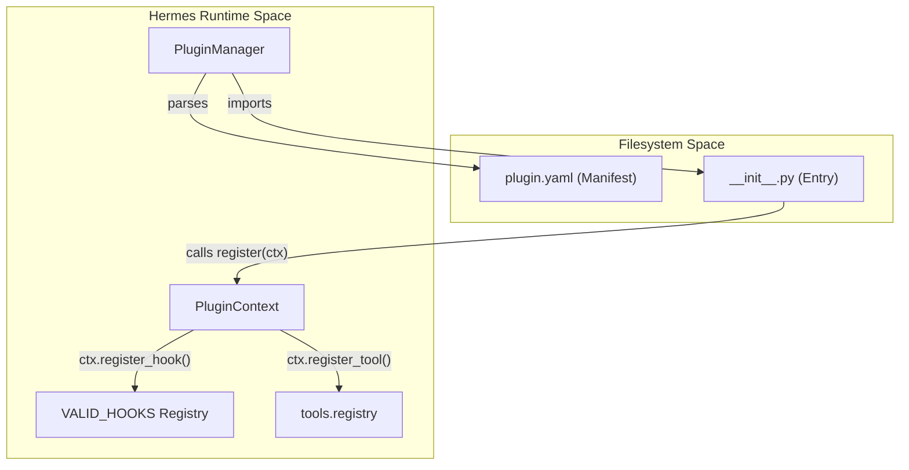
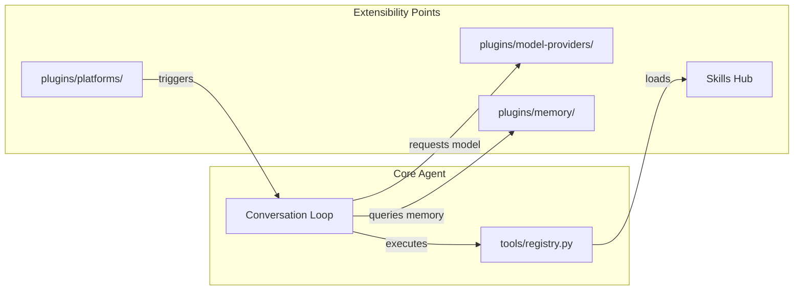

# Plugin System & Extensibility

Relevant source files

The following files were used as context for generating this wiki page:

- [agent/shell_hooks.py](../agent/shell_hooks.py)
- [agent/verify_hooks.py](../agent/verify_hooks.py)
- [docs/middleware/README.md](../docs/middleware/README.md)
- [gateway/builtin_hooks/__init__.py](../gateway/builtin_hooks/__init__.py)
- [gateway/hooks.py](../gateway/hooks.py)
- [hermes_cli/curses_ui.py](../hermes_cli/curses_ui.py)
- [hermes_cli/hooks.py](../hermes_cli/hooks.py)
- [hermes_cli/middleware.py](../hermes_cli/middleware.py)
- [hermes_cli/plugins.py](../hermes_cli/plugins.py)
- [hermes_cli/plugins_cmd.py](../hermes_cli/plugins_cmd.py)
- [hermes_cli/subcommands/acp.py](../hermes_cli/subcommands/acp.py)
- [hermes_cli/subcommands/claw.py](../hermes_cli/subcommands/claw.py)
- [hermes_cli/subcommands/insights.py](../hermes_cli/subcommands/insights.py)
- [hermes_cli/subcommands/memory.py](../hermes_cli/subcommands/memory.py)
- [hermes_cli/subcommands/pairing.py](../hermes_cli/subcommands/pairing.py)
- [hermes_cli/subcommands/plugins.py](../hermes_cli/subcommands/plugins.py)
- [hermes_cli/subcommands/skills.py](../hermes_cli/subcommands/skills.py)
- [hermes_cli/subcommands/tools.py](../hermes_cli/subcommands/tools.py)
- [tests/agent/test_shell_hooks.py](../tests/agent/test_shell_hooks.py)
- [tests/agent/test_shell_hooks_consent.py](../tests/agent/test_shell_hooks_consent.py)
- [tests/agent/test_subagent_stop_hook.py](../tests/agent/test_subagent_stop_hook.py)
- [tests/hermes_cli/test_curses_arrow_keys.py](../tests/hermes_cli/test_curses_arrow_keys.py)
- [tests/hermes_cli/test_curses_color_compat.py](../tests/hermes_cli/test_curses_color_compat.py)
- [tests/hermes_cli/test_curses_ui_search.py](../tests/hermes_cli/test_curses_ui_search.py)
- [tests/hermes_cli/test_plugins.py](../tests/hermes_cli/test_plugins.py)
- [tests/hermes_cli/test_plugins_cmd.py](../tests/hermes_cli/test_plugins_cmd.py)
- [tests/hermes_cli/test_plugins_cmd_enable_disable_nested.py](../tests/hermes_cli/test_plugins_cmd_enable_disable_nested.py)
- [tests/hermes_cli/test_plugins_cmd_list.py](../tests/hermes_cli/test_plugins_cmd_list.py)
- [tests/hermes_cli/test_setup_menu_curses_migration.py](../tests/hermes_cli/test_setup_menu_curses_migration.py)
- [tests/hermes_cli/test_subcommands_followup.py](../tests/hermes_cli/test_subcommands_followup.py)
- [tests/run_agent/test_concurrent_interrupt.py](../tests/run_agent/test_concurrent_interrupt.py)
- [tests/run_agent/test_image_rejection_fallback.py](../tests/run_agent/test_image_rejection_fallback.py)
- [tests/tools/test_approval_plugin_hooks.py](../tests/tools/test_approval_plugin_hooks.py)
- [tests/tools/test_local_tempdir.py](../tests/tools/test_local_tempdir.py)
- [tests/tools/test_registry.py](../tests/tools/test_registry.py)
- [tests/tools/test_tool_result_storage.py](../tests/tools/test_tool_result_storage.py)
- [tools/binary_extensions.py](../tools/binary_extensions.py)
- [tools/registry.py](../tools/registry.py)
- [tools/tool_result_storage.py](../tools/tool_result_storage.py)
- [web/src/pages/PluginsPage.tsx](../web/src/pages/PluginsPage.tsx)
- [website/docs/user-guide/features/hooks.md](../website/docs/user-guide/features/hooks.md)
- [website/docs/user-guide/features/plugins.md](../website/docs/user-guide/features/plugins.md)

Hermes is designed as a modular platform where core capabilities—ranging from model providers to messaging adapters—are implemented as plugins. This architecture allows users to extend the agent's functionality without modifying the core conversation loop or tool dispatch logic.

The plugin system supports four discovery sources:
1.  **Bundled plugins**: Shipped within the repo at `plugins/` [hermes_cli/plugins.py:7-9](../hermes_cli/plugins.py#L7-L9).
2.  **User plugins**: Located in `~/.hermes/plugins/` [hermes_cli/plugins.py:10-10](../hermes_cli/plugins.py#L10).
3.  **Project plugins**: Located in `./.hermes/plugins/` (opt-in via `HERMES_ENABLE_PROJECT_PLUGINS`) [hermes_cli/plugins.py:11-12](../hermes_cli/plugins.py#L11-L12).
4.  **Pip plugins**: Installed via Python packages using the `hermes_agent.plugins` entry-point [hermes_cli/plugins.py:13-14](../hermes_cli/plugins.py#L13-L14).

### Plugin Architecture & Lifecycle

The `PluginManager` handles discovery and registration [hermes_cli/plugins.py:16-16](../hermes_cli/plugins.py#L16). Each plugin must contain a `plugin.yaml` manifest and an `__init__.py` with a `register(ctx)` function [hermes_cli/plugins.py:19-20](../hermes_cli/plugins.py#L19-L20). Plugins can hook into the agent lifecycle, register new tools, or add slash commands.

**Natural Language to Code Entity Space: Plugin Lifecycle**

*Sources: [hermes_cli/plugins.py:1-44](../hermes_cli/plugins.py#L1-L44), [hermes_cli/plugins.py:135-185](../hermes_cli/plugins.py#L135-L185)*

For details, see [Plugin Architecture & Hooks](#8.1).

---

### Model Provider Plugins

Hermes abstracts LLM interaction through `ProviderProfile` plugins. These plugins define how to format messages for specific APIs, how to fetch available models, and how to handle provider-specific features like "thinking" blocks or native tool calling.

*   **Contract**: Located in `plugins/model-providers/`.
*   **Hooks**: `prepare_messages`, `build_extra_body`, and `fetch_models`.
*   **Bundled Providers**: Includes OpenRouter, Anthropic, Gemini, Bedrock, xAI, and DeepSeek.

For details, see [Model Provider Plugins](#8.2).

---

### Observability & NeMo Relay

Extensibility extends to how Hermes is monitored. The system supports middleware for intercepting LLM requests and tool executions.

*   **NeMo Relay**: Implements observability via ATOF/ATIF trajectory formats.
*   **Interceptors**: Plugins can use `llm_request` and `tool_request` middleware to modify payloads or log data to external services like Langfuse [hermes_cli/middleware.py:52-52](../hermes_cli/middleware.py#L52).
*   **Security**: Uses a "lazy-install" system for heavy dependencies to maintain a small core footprint.

For details, see [Observability & NeMo Relay](#8.3).

---

### Skills Hub & Distribution

Skills are high-level procedural memories (SOPs) that can be shared and installed. The `Skills Hub` provides a mechanism for discovering and managing these community-contributed capabilities.

*   **Discovery**: Integrated with `agentskills.io` and `ClaWHub`.
*   **Management**: Handled via `skills_hub.py` and the `hermes skills` CLI subcommand.
*   **Security**: Includes `skills_guard` for validating community content before execution.

**Natural Language to Code Entity Space: Extensibility Components**

*Sources: [tools/registry.py:1-26](../tools/registry.py#L1-L26), [hermes_cli/plugins.py:1330-1350](../hermes_cli/plugins.py#L1330-L1350)*

For details, see [Skills Hub & Distribution](#8.4).

---

### Hook Systems Overview

Hermes provides three distinct ways to run code at lifecycle events:

| System | Implementation | Scope | Use Case |
| :--- | :--- | :--- | :--- |
| **Plugin Hooks** | `ctx.register_hook()` | CLI + Gateway | Tool interception, metrics [website/docs/user-guide/features/hooks.md:14-14](../website/docs/user-guide/features/hooks.md#L14) |
| **Gateway Hooks** | `HOOK.yaml` + `handler.py` | Gateway Only | Notifications, webhooks [website/docs/user-guide/features/hooks.md:13-13](../website/docs/user-guide/features/hooks.md#L13) |
| **Shell Hooks** | `config.yaml` `hooks:` block | CLI + Gateway | Shell scripts for blocking/auto-formatting [agent/shell_hooks.py:1-15](../agent/shell_hooks.py#L1-L15) |

*Sources: [website/docs/user-guide/features/hooks.md:9-15](../website/docs/user-guide/features/hooks.md#L9-L15), [agent/shell_hooks.py:1-40](../agent/shell_hooks.py#L1-L40)*

---
