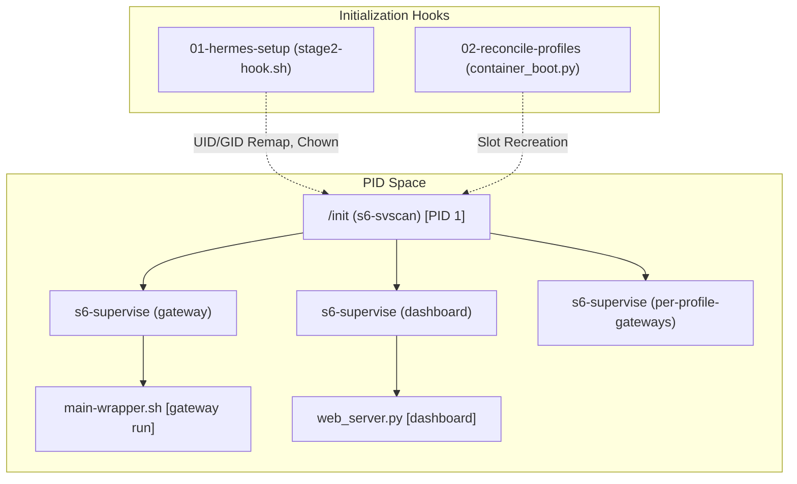
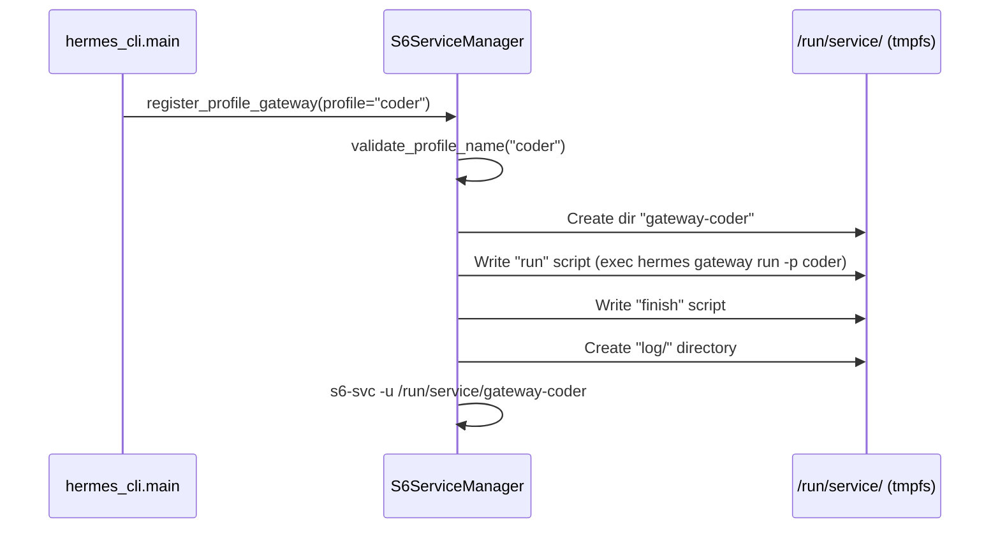

# Docker & Container Deployment

<details>
<summary>Relevant source files</summary>

The following files were used as context for generating this wiki page:

- [.dockerignore](../.dockerignore)
- [.hadolint.yaml](../.hadolint.yaml)
- [Dockerfile](../Dockerfile)
- contributors/emails/lucaskvasir@duck.com
- [docker-compose.yml](../docker-compose.yml)
- [docker/SOUL.md](../docker/SOUL.md)
- [docker/cont-init.d/02-reconcile-profiles](../docker/cont-init.d/02-reconcile-profiles)
- [docker/entrypoint.sh](../docker/entrypoint.sh)
- [docker/main-wrapper.sh](../docker/main-wrapper.sh)
- [docker/s6-rc.d/dashboard/run](../docker/s6-rc.d/dashboard/run)
- [docker/stage2-hook.sh](../docker/stage2-hook.sh)
- [hermes_cli/container_boot.py](../hermes_cli/container_boot.py)
- [hermes_cli/default_soul.py](../hermes_cli/default_soul.py)
- [hermes_cli/service_manager.py](../hermes_cli/service_manager.py)
- [scripts/docker_rebootstrap_nous_session.py](../scripts/docker_rebootstrap_nous_session.py)
- [setup.py](../setup.py)
- [tests/docker/__init__.py](../tests/docker/__init__.py)
- [tests/docker/conftest.py](../tests/docker/conftest.py)
- [tests/docker/test_container_restart.py](../tests/docker/test_container_restart.py)
- [tests/docker/test_dashboard.py](../tests/docker/test_dashboard.py)
- [tests/docker/test_immutable_install_permissions.py](../tests/docker/test_immutable_install_permissions.py)
- [tests/docker/test_main_invocation.py](../tests/docker/test_main_invocation.py)
- [tests/docker/test_profile_gateway.py](../tests/docker/test_profile_gateway.py)
- [tests/docker/test_s6_profile_gateway_integration.py](../tests/docker/test_s6_profile_gateway_integration.py)
- [tests/docker/test_tui_passthrough.py](../tests/docker/test_tui_passthrough.py)
- [tests/docker/test_zombie_reaping.py](../tests/docker/test_zombie_reaping.py)
- [tests/hermes_cli/test_cmd_update.py](../tests/hermes_cli/test_cmd_update.py)
- [tests/hermes_cli/test_container_boot.py](../tests/hermes_cli/test_container_boot.py)
- [tests/hermes_cli/test_cron_parser_builder.py](../tests/hermes_cli/test_cron_parser_builder.py)
- [tests/hermes_cli/test_profiles_s6_hooks.py](../tests/hermes_cli/test_profiles_s6_hooks.py)
- [tests/hermes_cli/test_run_with_idle_timeout.py](../tests/hermes_cli/test_run_with_idle_timeout.py)
- [tests/hermes_cli/test_service_manager.py](../tests/hermes_cli/test_service_manager.py)
- [tests/hermes_cli/test_tui_npm_install.py](../tests/hermes_cli/test_tui_npm_install.py)
- [tests/hermes_cli/test_web_ui_build.py](../tests/hermes_cli/test_web_ui_build.py)
- [tests/tools/test_docker_find.py](../tests/tools/test_docker_find.py)
- [tests/tools/test_docker_rebootstrap_nous_session.py](../tests/tools/test_docker_rebootstrap_nous_session.py)
- [tests/tools/test_dockerfile_node_modules_perms.py](../tests/tools/test_dockerfile_node_modules_perms.py)
- [tests/tools/test_dockerfile_pid1_reaping.py](../tests/tools/test_dockerfile_pid1_reaping.py)
- [website/docs/user-guide/docker.md](../website/docs/user-guide/docker.md)
- [website/i18n/zh-Hans/docusaurus-plugin-content-docs/current/reference/slash-commands.md](../website/i18n/zh-Hans/docusaurus-plugin-content-docs/current/reference/slash-commands.md)
- [website/i18n/zh-Hans/docusaurus-plugin-content-docs/current/user-guide/docker.md](../website/i18n/zh-Hans/docusaurus-plugin-content-docs/current/user-guide/docker.md)

</details>


Hermes Agent is designed for containerized environments using a multi-stage `Dockerfile` and the `s6-overlay` supervision system. The container architecture ensures process reliability, automatic zombie reaping, and persistent state management across restarts.

## Image Architecture & Supervision

The Hermes Docker image uses `s6-overlay` to manage the container lifecycle. Unlike traditional containers that run a single process as PID 1, Hermes uses `/init` (from `s6-overlay`) to act as a process supervisor and reaper [Dockerfile:25-28](../Dockerfile#L25-L28). This architecture prevents zombie processes—often generated by MCP stdio servers or browser daemons—from exhausting the PID table [tests/tools/test_dockerfile_pid1_reaping.py:8-10](../tests/tools/test_dockerfile_pid1_reaping.py#L8-L10).

### Process Hierarchy
The following diagram illustrates the transition from the container entrypoint to the supervised service tree.

**Diagram: Container Boot to Service Supervision**

Sources: [Dockerfile:25-28](../Dockerfile#L25-L28), [docker/stage2-hook.sh:1-11](../docker/stage2-hook.sh#L1-L11), [hermes_cli/container_boot.py:11-14](../hermes_cli/container_boot.py#L11-L14), [website/docs/user-guide/docker.md:61-64](../website/docs/user-guide/docker.md#L61-L64)

## Container Boot Sequence

The boot sequence is divided into two primary stages executed before user services start:

1.  **Stage 2 Hook (`stage2-hook.sh`)**:
    *   **UID/GID Remapping**: Adjusts the internal `hermes` user to match the host's `PUID`/`PGID` (or `HERMES_UID`/`HERMES_GID`) to ensure volume permissions are consistent with the host [docker/stage2-hook.sh:104-116](../docker/stage2-hook.sh#L104-L116).
    *   **Docker-in-Docker (DooD) Support**: Detects the GID of `/var/run/docker.sock` and adds the `hermes` user to a matching group, enabling the `docker` terminal backend from within the container [docker/stage2-hook.sh:118-135](../docker/stage2-hook.sh#L118-L135).
    *   **Config Seeding**: Populates `$HERMES_HOME` with default configuration if the volume is empty.

2.  **Profile Reconciliation (`container_boot.py`)**:
    *   Because `/run/service/` (where s6 stores service definitions) is on `tmpfs`, it is wiped on restart [hermes_cli/container_boot.py:3-5](../hermes_cli/container_boot.py#L3-L5).
    *   The `reconcile_profile_gateways` function walks the persistent volume, reads `gateway_state.json` for each profile, and recreates the s6 service slots [hermes_cli/container_boot.py:8-9](../hermes_cli/container_boot.py#L8-L9).
    *   **Autostart Logic**: Only profiles marked as `running` in their persisted state are automatically restarted [hermes_cli/container_boot.py:39-40](../hermes_cli/container_boot.py#L39-L40).

Sources: [docker/stage2-hook.sh:3-4](../docker/stage2-hook.sh#L3-L4), [hermes_cli/container_boot.py:1-18](../hermes_cli/container_boot.py#L1-L18), [hermes_cli/container_boot.py:88-110](../hermes_cli/container_boot.py#L88-L110)

## Service Management (s6 Backend)

Hermes implements a `ServiceManager` protocol to abstract init-system operations. Inside the container, the `S6ServiceManager` class handles runtime registration of profile gateways [hermes_cli/service_manager.py:58-62](../hermes_cli/service_manager.py#L58-L62).

### Service Registration Data Flow
The following diagram shows how the `ServiceManager` interacts with the s6 filesystem to manage gateway instances.

**Diagram: s6 Service Registration Flow**

Sources: [hermes_cli/service_manager.py:25-30](../hermes_cli/service_manager.py#L25-L30), [hermes_cli/service_manager.py:73-83](../hermes_cli/service_manager.py#L73-L83), [hermes_cli/service_manager.py:118-119](../hermes_cli/service_manager.py#L118-L119)

### Key Service Manager Functions
| Function | File | Description |
| :--- | :--- | :--- |
| `detect_service_manager` | [hermes_cli/service_manager.py:86-101](../hermes_cli/service_manager.py#L86-L101) | Identifies the init system (s6, systemd, launchd, windows). |
| `_s6_running` | [hermes_cli/service_manager.py:129-159](../hermes_cli/service_manager.py#L129-L159) | Probes `/proc/1/comm` for `s6-svscan` to verify the s6 environment. |
| `reconcile_profile_gateways` | [hermes_cli/container_boot.py:88-125](../hermes_cli/container_boot.py#L88-L125) | Rebuilds the dynamic s6 service tree from persistent profile data. |

## Dashboard & Gateway Integration

The Web Dashboard is managed as a supervised s6 service (`dashboard`) [website/docs/user-guide/docker.md:104-105](../website/docs/user-guide/docker.md#L104-L105). It is enabled by setting `HERMES_DASHBOARD=1` [website/docs/user-guide/docker.md:113](../website/docs/user-guide/docker.md#L113).

*   **Logging**: The gateway's logs are routed to per-profile s6-log files, while the dashboard's `stdout`/`stderr` is forwarded directly to `docker logs` to avoid interleaving streams [website/docs/user-guide/docker.md:117](../website/docs/user-guide/docker.md#L117).
*   **Networking**: The dashboard binds to `0.0.0.0` by default inside the container to allow host-side access via port mapping (typically `-p 9119:9119`) [website/docs/user-guide/docker.md:126](../website/docs/user-guide/docker.md#L126).

Sources: [website/docs/user-guide/docker.md:102-117](../website/docs/user-guide/docker.md#L102-L117), [Dockerfile:25-28](../Dockerfile#L25-L28)

## Docker-in-Docker (DooD) & Terminal Backend

When Hermes runs inside Docker, it can still use Docker as a sandboxed execution environment for tools (the `docker` terminal backend). This requires bind-mounting the host socket:

```bash
docker run -v /var/run/docker.sock:/var/run/docker.sock ...
```

The `stage2-hook.sh` specifically handles the permission mapping for this socket so the unprivileged `hermes` user inside the container can execute `docker` commands without `EACCES` errors [docker/stage2-hook.sh:118-135](../docker/stage2-hook.sh#L118-L135).

Sources: [website/docs/user-guide/docker.md:9-12](../website/docs/user-guide/docker.md#L9-L12), [docker/stage2-hook.sh:137-145](../docker/stage2-hook.sh#L137-L145)

## Dockerfile Build Stages

The `Dockerfile` uses a sophisticated multi-stage build to optimize image size and layer caching:

1.  **uv_source**: Pulls the `uv` binary for fast Python package management [Dockerfile:1](../Dockerfile#L1).
2.  **node_source**: Pulls Node.js 22 LTS to ensure modern JS support for the TUI and Dashboard [Dockerfile:9](../Dockerfile#L9).
3.  **Dependency Layer**:
    *   Installs system libraries (ffmpeg, ripgrep, libolm, etc.) [Dockerfile:29-32](../Dockerfile#L29-L32).
    *   Downloads and verifies `s6-overlay` tarballs for the target architecture [Dockerfile:48-76](../Dockerfile#L48-L76).
    *   Caches `npm install` for `ui-tui` and `web` dashboard by copying manifests before full source [Dockerfile:109-123](../Dockerfile#L109-L123).
4.  **Final Stage**:
    *   Copies the `uv` and `node` binaries [Dockerfile:93-100](../Dockerfile#L93-L100).
    *   Performs `uv sync` with the `messaging` and `matrix` extras pre-installed to avoid runtime delays [Dockerfile:140-143](../Dockerfile#L140-L143).

Sources: [Dockerfile:1-10](../Dockerfile#L1-L10), [Dockerfile:29-32](../Dockerfile#L29-L32), [Dockerfile:109-123](../Dockerfile#L109-L123), [tests/tools/test_dockerfile_pid1_reaping.py:161-175](../tests/tools/test_dockerfile_pid1_reaping.py#L161-L175)

---
