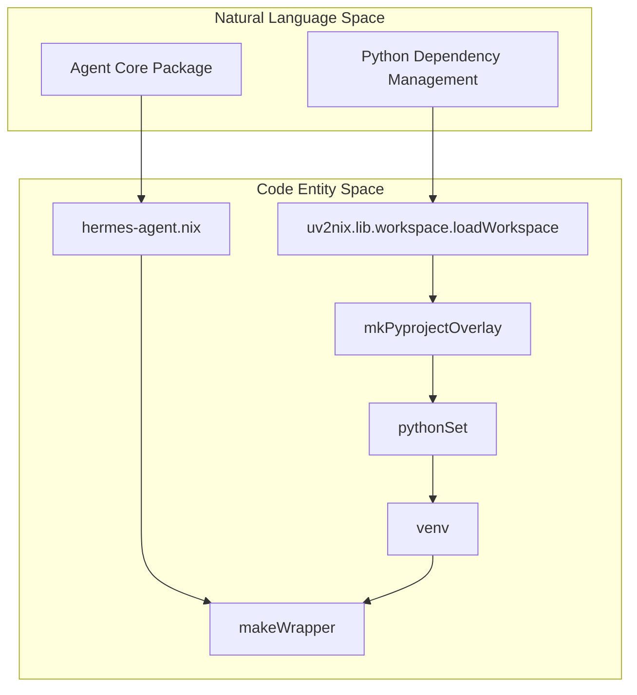
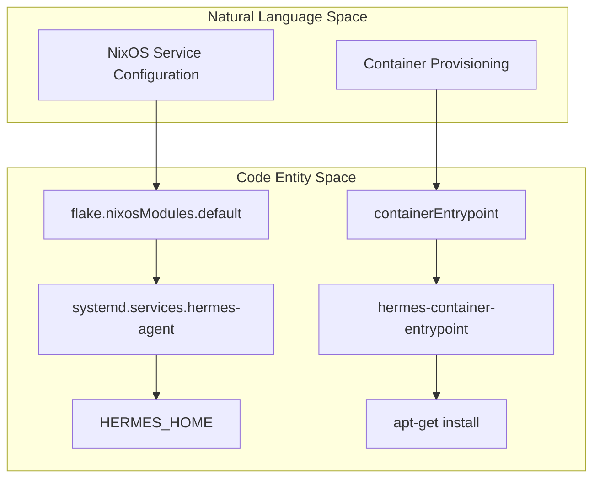

# Nix Packaging & Flake

Relevant source files

The following files were used as context for generating this wiki page:

- [.envrc](../.envrc)
- [flake.lock](../flake.lock)
- [flake.nix](../flake.nix)
- [nix/checks.nix](../nix/checks.nix)
- [nix/desktop.nix](../nix/desktop.nix)
- [nix/devShell.nix](../nix/devShell.nix)
- [nix/hermes-agent.nix](../nix/hermes-agent.nix)
- [nix/lib.nix](../nix/lib.nix)
- [nix/nixosModules.nix](../nix/nixosModules.nix)
- [nix/overlays.nix](../nix/overlays.nix)
- [nix/packages.nix](../nix/packages.nix)
- [nix/python.nix](../nix/python.nix)
- [nix/tui.nix](../nix/tui.nix)
- [nix/web.nix](../nix/web.nix)
- [scripts/capture-cage-terminal.sh](../scripts/capture-cage-terminal.sh)
- [website/docs/getting-started/nix-setup.md](../website/docs/getting-started/nix-setup.md)
- [website/docs/getting-started/termux.md](../website/docs/getting-started/termux.md)

Hermes Agent provides a comprehensive Nix-based infrastructure, including a Flake for reproducible builds, a NixOS module for declarative deployments, and specialized derivations for its TUI, Web, and Desktop interfaces. The packaging strategy utilizes `uv2nix` for Python dependency management and `buildNpmPackage` for JavaScript/TypeScript components.

## Flake Structure & Architecture

The project's `flake.nix` serves as the entry point for all Nix-related operations. It utilizes `flake-parts` to manage per-system outputs and organizes the build logic into several specialized files within the `nix/` directory.

### Build Topology

The build is split between the Python-based agent core and the React-based frontend components. To prevent unnecessary rebuilds, the project implements strict source filtering.

| Component | Logic File | Build System | Purpose |
| :--- | :--- | :--- | :--- |
| **Agent Core** | [nix/python.nix:1-158](../nix/python.nix#L1-L158) | `uv2nix` | Builds the Python virtual environment and `hermes-agent` wheel. |
| **TUI (Ink)** | [nix/tui.nix:1-38](../nix/tui.nix#L1-L38) | `buildNpmPackage` | Compiles the React/Ink terminal interface using `esbuild`. |
| **Web Dashboard** | [nix/web.nix:1-41](../nix/web.nix#L1-L41) | `buildNpmPackage` | Builds the Vite/React dashboard. |
| **Package Wrapper** | [nix/hermes-agent.nix:1-199](../nix/hermes-agent.nix#L1-L199) | `makeWrapper` | Combines Python, Node, and assets into a unified binary. |

### Source Filtering Logic
The `pythonSrc` filter in [nix/lib.nix:72-149](../nix/lib.nix#L72-L149) ensures that changes to frontend code (`.tsx`, `.mjs`), documentation, or Nix files do not trigger a re-compilation of the Python virtual environment. Conversely, the `npmDepsSrc` filter in [nix/lib.nix:167-171](../nix/lib.nix#L167-L171) isolates the JavaScript dependency tree.

**Sources:** [nix/lib.nix:1-171](../nix/lib.nix#L1-L171), [nix/packages.nix:1-65](../nix/packages.nix#L1-L65), [flake.nix:1-100](../flake.nix#L1-L100)

## Python Environment (uv2nix)

The core agent is packaged using `uv2nix`, which translates `uv.lock` directly into Nix derivations. This ensures that the production environment exactly matches the developer's lockfile.

### Virtual Environment Construction
The function `mkHermesVenv` in [nix/hermes-agent.nix:43-49](../nix/hermes-agent.nix#L43-L49) generates the sealed environment. It supports `extraDependencyGroups` to allow users to customize the inclusion of optional stacks (e.g., `voice`, `hindsight`, `matrix`) via overrides [nix/packages.nix:21-43](../nix/packages.nix#L21-L43).

### Platform Overrides
For `aarch64-darwin` (Apple Silicon), certain packages like `onnxruntime` and `faster-whisper` do not have compatible wheels available via standard `uv2nix` resolution. The `pythonPackageOverrides` block in [nix/python.nix:64-101](../nix/python.nix#L64-L101) explicitly maps these to pre-built versions from `nixpkgs` using `hacks.nixpkgsPrebuilt`.

### Code Entity Mapping: Python Build

**Sources:** [nix/python.nix:15-123](../nix/python.nix#L15-L123), [nix/hermes-agent.nix:43-51](../nix/hermes-agent.nix#L43-L51)

## Frontend Packaging (NPM Workspaces)

Hermes uses a monorepo structure for its JavaScript components, managed via NPM workspaces.

### Shared Library (`hermesNpmLib`)
The `mkNpmPassthru` helper in [nix/lib.nix:179-204](../nix/lib.nix#L179-L204) handles workspace resolution. It ensures that if a package (like `web`) depends on a local workspace member (like `apps/shared`), both are included in the build source.

### Build Processes
*   **TUI:** Uses `node ui-tui/scripts/build.mjs` to execute `esbuild`, bundling the React/Ink components into a single entry point [nix/tui.nix:20-24](../nix/tui.nix#L20-L24).
*   **Web:** Executes `tsc -b` for type checking followed by `vite build`, overriding the default `outDir` to `dist` for Nix compatibility [nix/web.nix:22-30](../nix/web.nix#L22-L30).

**Sources:** [nix/tui.nix:1-38](../nix/tui.nix#L1-L38), [nix/web.nix:1-41](../nix/web.nix#L1-L41), [nix/lib.nix:179-204](../nix/lib.nix#L179-L204)

## NixOS Module

The NixOS module [nix/nixosModules.nix:27-163](../nix/nixosModules.nix#L27-L163) provides a declarative way to deploy the Hermes Agent as a system service.

### Deployment Modes
1.  **Native Systemd:** Runs the `hermes-agent` binary as a standard service under a dedicated `hermes` user.
2.  **Container Mode:** Runs the agent inside a persistent OCI container (Docker or Podman) [nix/nixosModules.nix:88-90](../nix/nixosModules.nix#L88-L90). This mode allows the agent to perform self-modifications (e.g., `apt-get install` or `pip install`) within a writable layer while the host remains immutable [nix/nixosModules.nix:7-11](../nix/nixosModules.nix#L7-L11).

### Configuration & Secrets
The module generates a `config.yaml` from the `services.hermes-agent.settings` attrset [nix/nixosModules.nix:52-55](../nix/nixosModules.nix#L52-L55). Secrets are handled via `environmentFiles`, which are merged into a `.env` file at the `HERMES_HOME` location [nix/nixosModules.nix:67-69](../nix/nixosModules.nix#L67-L69).

### Code Entity Mapping: NixOS Module

**Sources:** [nix/nixosModules.nix:27-155](../nix/nixosModules.nix#L27-L155)

## Development Shell & Checks

### Dev Shell
The `devShell` defined in [nix/devShell.nix:27-68](../nix/devShell.nix#L27-L68) provides a complete environment for Hermes development. It includes:
*   `uv` for Python package management.
*   `playwright-test` for E2E testing.
*   `cage` and `ghostty` for headless Wayland testing and UI captures [nix/devShell.nix:38-48](../nix/devShell.nix#L38-L48).
*   An `editableVenv` that points to the live source code instead of the Nix store [nix/python.nix:154-156](../nix/python.nix#L154-L156).

### Build-time Checks
The `nix/checks.nix` file defines several verification steps:
*   **`cross-eval`**: Ensures the package evaluates on Linux and Darwin [nix/checks.nix:42-60](../nix/checks.nix#L42-L60).
*   **`package-contents`**: Verifies that the `hermes` and `hermes-agent` binaries are present and executable [nix/checks.nix:79-84](../nix/checks.nix#L79-L84).
*   **`bundled-skills`**: Confirms that `SKILL.md` files are correctly symlinked into the final package [nix/checks.nix:124-133](../nix/checks.nix#L124-L133).

**Sources:** [nix/devShell.nix:1-71](../nix/devShell.nix#L1-L71), [nix/checks.nix:1-152](../nix/checks.nix#L1-L152)

## Termux Setup

For Android users, Hermes provides a specialized installation path within Termux. While not using Nix directly on Android, the Termux setup is treated as a "Tier 2" platform alongside Nix [website/docs/getting-started/termux.md:9-11](../website/docs/getting-started/termux.md#L9-L11).

The Termux installer:
*   Uses `pkg` for system dependencies (clang, rust, nodejs, etc.) [website/docs/getting-started/termux.md:73-76](../website/docs/getting-started/termux.md#L73-L76).
*   Sets `ANDROID_API_LEVEL` to ensure Rust-based Python wheels (like `jiter`) build correctly [website/docs/getting-started/termux.md:99-103](../website/docs/getting-started/termux.md#L99-L103).
*   Installs the `[termux]` extra, which excludes heavy or incompatible dependencies like `faster-whisper` [website/docs/getting-started/termux.md:173-186](../website/docs/getting-started/termux.md#L173-L186).

**Sources:** [website/docs/getting-started/termux.md:1-246](../website/docs/getting-started/termux.md#L1-L246)

---
