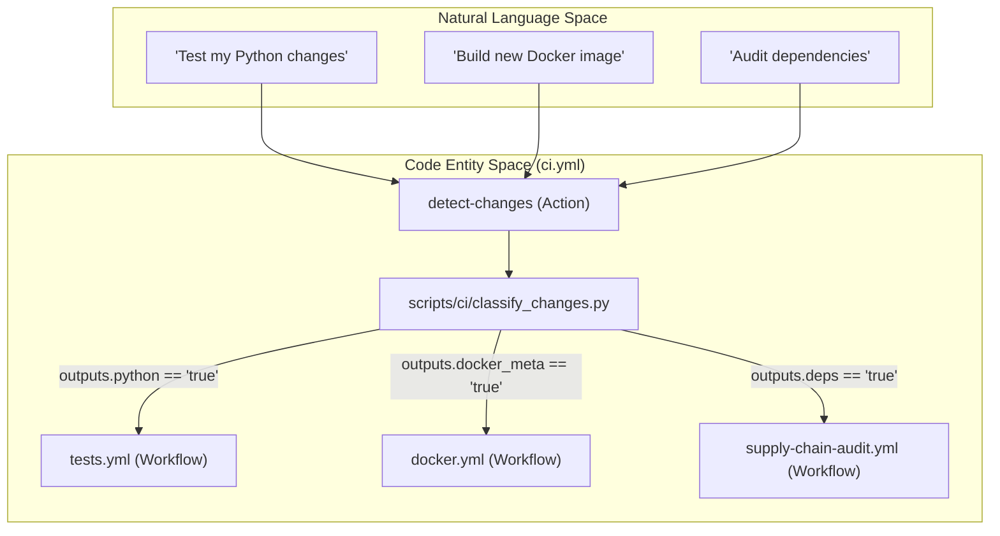
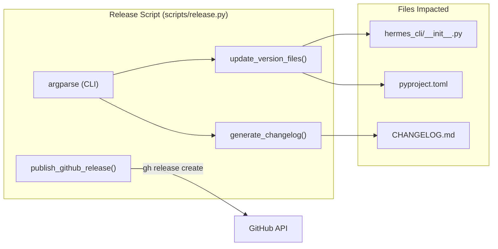

# CI/CD & Release Automation

Relevant source files

The following files were used as context for generating this wiki page:

- [.github/actions/detect-changes/action.yml](../.github/actions/detect-changes/action.yml)
- [.github/actions/get-app-token/action.yml](../.github/actions/get-app-token/action.yml)
- [.github/workflows/ci.yml](../.github/workflows/ci.yml)
- [.github/workflows/contributor-check.yml](../.github/workflows/contributor-check.yml)
- [.github/workflows/deploy-site.yml](../.github/workflows/deploy-site.yml)
- [.github/workflows/docker-lint.yml](../.github/workflows/docker-lint.yml)
- [.github/workflows/docker.yml](../.github/workflows/docker.yml)
- [.github/workflows/docs-site-checks.yml](../.github/workflows/docs-site-checks.yml)
- [.github/workflows/history-check.yml](../.github/workflows/history-check.yml)
- [.github/workflows/js-autofix.yml](../.github/workflows/js-autofix.yml)
- [.github/workflows/lint.yml](../.github/workflows/lint.yml)
- [.github/workflows/osv-scanner.yml](../.github/workflows/osv-scanner.yml)
- [.github/workflows/publish-e2e-evidence.yml](../.github/workflows/publish-e2e-evidence.yml)
- [.github/workflows/review-labels.yml](../.github/workflows/review-labels.yml)
- [.github/workflows/skills-index-freshness.yml](../.github/workflows/skills-index-freshness.yml)
- [.github/workflows/skills-index.yml](../.github/workflows/skills-index.yml)
- [.github/workflows/supply-chain-audit.yml](../.github/workflows/supply-chain-audit.yml)
- [.github/workflows/tests.yml](../.github/workflows/tests.yml)
- [.github/workflows/uv-lockfile-check.yml](../.github/workflows/uv-lockfile-check.yml)
- [agent/i18n.py](../agent/i18n.py)
- [agent/pet/generate/atlas.py](../agent/pet/generate/atlas.py)
- [agent/pet/generate/imagegen.py](../agent/pet/generate/imagegen.py)
- [agent/pet/generate/orchestrate.py](../agent/pet/generate/orchestrate.py)
- [agent/pet/generate/prompts.py](../agent/pet/generate/prompts.py)
- [apps/desktop/src/app/pet-generate/components/provider-picker.tsx](../apps/desktop/src/app/pet-generate/components/provider-picker.tsx)
- [hermes_cli/__init__.py](../hermes_cli/__init__.py)
- [optional-mcps/unreal-engine/manifest.yaml](../optional-mcps/unreal-engine/manifest.yaml)
- [plugins/observability/nemo_relay/README.md](../plugins/observability/nemo_relay/README.md)
- [plugins/observability/nemo_relay/__init__.py](../plugins/observability/nemo_relay/__init__.py)
- [pyproject.toml](../pyproject.toml)
- [scripts/ci/assemble_review_comment.py](../scripts/ci/assemble_review_comment.py)
- [scripts/ci/classify_changes.py](../scripts/ci/classify_changes.py)
- [scripts/ci/emit_review_status.py](../scripts/ci/emit_review_status.py)
- [scripts/ci/live_comment.py](../scripts/ci/live_comment.py)
- [scripts/ci/timings_report.py](../scripts/ci/timings_report.py)
- [scripts/contributor_audit.py](../scripts/contributor_audit.py)
- [scripts/release.py](../scripts/release.py)
- [scripts/run_tests.sh](../scripts/run_tests.sh)
- [scripts/run_tests_parallel.py](../scripts/run_tests_parallel.py)
- [tests/agent/test_i18n.py](../tests/agent/test_i18n.py)
- [tests/agent/test_pet_generate.py](../tests/agent/test_pet_generate.py)
- [tests/ci/test_assemble_review_comment.py](../tests/ci/test_assemble_review_comment.py)
- [tests/ci/test_classify_changes.py](../tests/ci/test_classify_changes.py)
- [tests/ci/test_live_comment.py](../tests/ci/test_live_comment.py)
- [tests/ci/test_timings_report.py](../tests/ci/test_timings_report.py)
- [tests/conftest.py](../tests/conftest.py)
- [tests/docker/test_smoke.py](../tests/docker/test_smoke.py)
- [tests/hermes_cli/test_api_key_providers.py](../tests/hermes_cli/test_api_key_providers.py)
- [tests/hermes_cli/test_cmd_update_docker.py](../tests/hermes_cli/test_cmd_update_docker.py)
- [tests/hermes_cli/test_ensure_utf8_locale.py](../tests/hermes_cli/test_ensure_utf8_locale.py)
- [tests/plugins/test_nemo_relay_plugin.py](../tests/plugins/test_nemo_relay_plugin.py)
- [tests/test_live_system_guard_self_test.py](../tests/test_live_system_guard_self_test.py)
- [tests/test_packaging_metadata.py](../tests/test_packaging_metadata.py)
- [tests/test_project_metadata.py](../tests/test_project_metadata.py)
- [tests/test_run_tests_parallel.py](../tests/test_run_tests_parallel.py)
- [tests/tools/test_lazy_deps.py](../tests/tools/test_lazy_deps.py)
- [tools/lazy_deps.py](../tools/lazy_deps.py)
- [uv.lock](../uv.lock)

This page details the infrastructure and automation pipelines that ensure the stability, security, and delivery of the Hermes Agent codebase. The system leverages GitHub Actions for continuous integration, a custom parallel test runner for high-throughput validation, and a CalVer-based release automation suite.

## Orchestration & Change Detection

The CI pipeline uses a "Narrow Waist" orchestration model defined in `.github/workflows/ci.yml`. Instead of every sub-workflow triggering on every push, a central `detect` job runs first to classify changes and gate downstream execution.

### Change Detection Logic
The `detect` job utilizes a custom action located at `.github/actions/detect-changes/action.yml` (invoked at [.github/workflows/ci.yml:59-61](../.github/workflows/ci.yml#L59-L61)) which calls `scripts/ci/classify_changes.py`. This script analyzes the diff to set boolean outputs for specific "lanes":
*   `python`: Triggered by changes in `agent/`, `hermes_cli/`, or `pyproject.toml`.
*   `frontend`: Triggered by changes in `ui-tui/` or `desktop/`.
*   `docker_meta`: Triggered by changes to `Dockerfile` or `s6-rc` service definitions.
*   `scan`: Triggered by sensitive files requiring supply-chain auditing.

### System Flow: CI Orchestration
The following diagram illustrates how natural language intents (e.g., "Run Python tests") map to specific code entities and workflow gates.

**CI Pipeline Mapping**

**Sources:** [.github/workflows/ci.yml:39-148](../.github/workflows/ci.yml#L39-L148), [.github/actions/detect-changes/action.yml:1-10](../.github/actions/detect-changes/action.yml#L1-L10).

---

## Parallel Testing Infrastructure

Hermes employs a custom test runner, `scripts/run_tests_parallel.py`, to handle a suite of over 17,000 tests while maintaining strict process isolation.

### Process Isolation & Invariants
To prevent cross-test contamination, the runner spawns a fresh `python -m pytest <file>` subprocess for every single test file .scripts/run_tests_parallel.py:9-15. This is supplemented by `tests/conftest.py`, which enforces hermetic invariants:
*   **Credential Scrubbing**: Unsets all environment variables ending in `_API_KEY`, `_TOKEN`, etc., to prevent local developer keys from leaking into CI .tests/conftest.py:5-7, .tests/conftest.py:57-73.
*   **Isolated Home**: Redirects `HERMES_HOME` to a per-test temporary directory .tests/conftest.py:8-9.
*   **Deterministic Runtime**: Forces `TZ=UTC` and `PYTHONHASHSEED=0` .tests/conftest.py:13.

### Sharding & LPT Slicing
The `tests.yml` workflow implements sharding across multiple runners (default: 8 slices) [.github/workflows/tests.yml:6-9](../.github/workflows/tests.yml#L6-L9). 
1.  **Generation**: The `generate` job runs `scripts/run_tests_parallel.py --generate-slices` [.github/workflows/tests.yml:45](../.github/workflows/tests.yml#L45).
2.  **LPT (Longest Processing Time)**: The runner uses `test_durations.json` to distribute files across slices such that total execution time is balanced .scripts/run_tests_parallel.py:97-100.
3.  **Execution**: Each shard runs its assigned files using `scripts/run_tests.sh` [.github/workflows/tests.yml:116](../.github/workflows/tests.yml#L116).

**Sources:** [scripts/run_tests_parallel.py:1-100](../scripts/run_tests_parallel.py#L1-L100), [tests/conftest.py:1-159](../tests/conftest.py#L1-L159), [.github/workflows/tests.yml:19-116](../.github/workflows/tests.yml#L19-L116).

---

## Supply Chain & Security Auditing

Security is enforced through multiple specialized workflows that monitor dependencies and code patterns.

### Supply Chain Audit
The `supply-chain-audit.yml` workflow performs high-signal scanning for critical indicators of compromise, such as the "litellm-style" payload [.github/workflows/supply-chain-audit.yml:3-10](../.github/workflows/supply-chain-audit.yml#L3-L10).
*   **Critical Patterns**: It scans for `.pth` file modifications (which execute on interpreter startup) and the combination of `base64` decoding with `exec()` or `eval()` on the same line [.github/workflows/supply-chain-audit.yml:90-115](../.github/workflows/supply-chain-audit.yml#L90-L115).
*   **Dependency Pinning**: The project enforces exact-version pinning in `pyproject.toml` to prevent PyPI "quarantine" events from affecting users .pyproject.toml:20-32.

### OSV Scanning
The `osv-scanner.yml` workflow uses the Google OSV-Scanner to check `uv.lock` and `package-lock.json` against known vulnerability databases [.github/workflows/osv-scanner.yml:1-20](../.github/workflows/osv-scanner.yml#L1-L20).

### Static Analysis & Linting
*   **Ruff Enforcement**: The `lint.yml` workflow runs `ruff check` to block merges containing "footguns" like unspecified encodings in `open()` calls (PLW1514) [.github/workflows/lint.yml:116-143](../.github/workflows/lint.yml#L116-L143).
*   **Windows Footguns**: A specialized script, `scripts/check-windows-footguns.py`, blocks POSIX-only primitives like `os.killpg` or `os.setsid` that cause crashes on Windows [.github/workflows/lint.yml:144-162](../.github/workflows/lint.yml#L144-L162).

**Sources:** [.github/workflows/supply-chain-audit.yml:87-152](../.github/workflows/supply-chain-audit.yml#L87-L152), .pyproject.toml:19-40, [.github/workflows/lint.yml:1-163](../.github/workflows/lint.yml#L1-L163).

---

## Release Automation (CalVer)

Hermes uses Calendar Versioning (CalVer) in the format `YYYY.M.D`. The release process is managed by `scripts/release.py`.

### Release Lifecycle
The `release.py` script automates the following:
1.  **Version Management**: Updates `__version__` and `__release_date__` in `hermes_cli/__init__.py` .hermes_cli/__init__.py:17-18 and the `version` field in `pyproject.toml` .pyproject.toml:5.
2.  **Contributor Audit**: Resolves Git emails to GitHub usernames using `scripts/contributor_audit.py` and a mapping in `scripts/release.py` .scripts/release.py:46-95.
3.  **Changelog Generation**: Groups commits by area (Agent, Gateway, TUI, Tools) and generates a Markdown changelog .scripts/release.py:2-5.
4.  **GitHub Release**: Uses the `gh` CLI to create tags and upload release assets if the `--publish` flag is provided .scripts/release.py:14.

### Deployment Targets
*   **Docker**: The `docker.yml` workflow builds multi-arch images (`amd64`, `arm64`) and pushes them to GitHub Container Registry (GHCR) upon successful merge to `main` [.github/workflows/ci.yml:130-138](../.github/workflows/ci.yml#L130-L138).
*   **Docs Site**: `deploy-site.yml` automates the deployment of the documentation site via GitHub Pages [.github/workflows/ci.yml:95-99](../.github/workflows/ci.yml#L95-L99).

**Release Logic Mapping**

**Sources:** [scripts/release.py:1-95](../scripts/release.py#L1-L95), [hermes_cli/__init__.py:1-19](../hermes_cli/__init__.py#L1-L19), [pyproject.toml:1-15](../pyproject.toml#L1-L15).

---

## Lazy Dependency Management

To minimize the core "blast radius" and installation bloat, Hermes uses a lazy-loading system for optional provider SDKs.

### `tools/lazy_deps.py`
This module defines an allowlist of packages that can be installed at runtime if a specific feature is invoked .tools/lazy_deps.py:97-150.
*   **Functionality**: When a provider (e.g., `anthropic` or `bedrock`) is first used, the agent calls `ensure("provider.anthropic")` .tools/lazy_deps.py:18-24.
*   **Isolation**: If the environment is an immutable Docker image, lazy installs are redirected to a writable directory on a durable volume and appended to `sys.path` to prevent shadowing core modules .tools/lazy_deps.py:29-44.

**Sources:** [tools/lazy_deps.py:1-150](../tools/lazy_deps.py#L1-L150).

---
