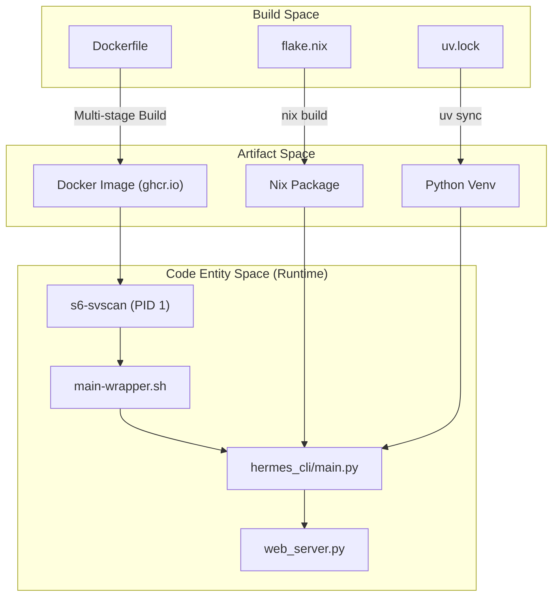

# Infrastructure & DevOps

Relevant source files

The following files were used as context for generating this wiki page:

- [.dockerignore](../.dockerignore)
- [.github/actions/detect-changes/action.yml](../.github/actions/detect-changes/action.yml)
- [.github/actions/get-app-token/action.yml](../.github/actions/get-app-token/action.yml)
- [.github/workflows/ci.yml](../.github/workflows/ci.yml)
- [.github/workflows/contributor-check.yml](../.github/workflows/contributor-check.yml)
- [.github/workflows/deploy-site.yml](../.github/workflows/deploy-site.yml)
- [.github/workflows/docker-lint.yml](../.github/workflows/docker-lint.yml)
- [.github/workflows/docker.yml](../.github/workflows/docker.yml)
- [.github/workflows/docs-site-checks.yml](../.github/workflows/docs-site-checks.yml)
- [.github/workflows/history-check.yml](../.github/workflows/history-check.yml)
- [.github/workflows/js-autofix.yml](../.github/workflows/js-autofix.yml)
- [.github/workflows/lint.yml](../.github/workflows/lint.yml)
- [.github/workflows/osv-scanner.yml](../.github/workflows/osv-scanner.yml)
- [.github/workflows/publish-e2e-evidence.yml](../.github/workflows/publish-e2e-evidence.yml)
- [.github/workflows/review-labels.yml](../.github/workflows/review-labels.yml)
- [.github/workflows/skills-index-freshness.yml](../.github/workflows/skills-index-freshness.yml)
- [.github/workflows/skills-index.yml](../.github/workflows/skills-index.yml)
- [.github/workflows/supply-chain-audit.yml](../.github/workflows/supply-chain-audit.yml)
- [.github/workflows/tests.yml](../.github/workflows/tests.yml)
- [.github/workflows/uv-lockfile-check.yml](../.github/workflows/uv-lockfile-check.yml)
- [.hadolint.yaml](../.hadolint.yaml)
- [Dockerfile](../Dockerfile)
- contributors/emails/lucaskvasir@duck.com
- [docker-compose.yml](../docker-compose.yml)
- [docker/SOUL.md](../docker/SOUL.md)
- [docker/entrypoint.sh](../docker/entrypoint.sh)
- [docker/main-wrapper.sh](../docker/main-wrapper.sh)
- [docker/stage2-hook.sh](../docker/stage2-hook.sh)
- [hermes_cli/default_soul.py](../hermes_cli/default_soul.py)
- [scripts/ci/assemble_review_comment.py](../scripts/ci/assemble_review_comment.py)
- [scripts/ci/classify_changes.py](../scripts/ci/classify_changes.py)
- [scripts/ci/emit_review_status.py](../scripts/ci/emit_review_status.py)
- [scripts/ci/live_comment.py](../scripts/ci/live_comment.py)
- [scripts/ci/timings_report.py](../scripts/ci/timings_report.py)
- [scripts/docker_rebootstrap_nous_session.py](../scripts/docker_rebootstrap_nous_session.py)
- [setup.py](../setup.py)
- [tests/ci/test_assemble_review_comment.py](../tests/ci/test_assemble_review_comment.py)
- [tests/ci/test_classify_changes.py](../tests/ci/test_classify_changes.py)
- [tests/ci/test_live_comment.py](../tests/ci/test_live_comment.py)
- [tests/ci/test_timings_report.py](../tests/ci/test_timings_report.py)
- [tests/docker/test_immutable_install_permissions.py](../tests/docker/test_immutable_install_permissions.py)
- [tests/docker/test_smoke.py](../tests/docker/test_smoke.py)
- [tests/hermes_cli/test_cmd_update.py](../tests/hermes_cli/test_cmd_update.py)
- [tests/hermes_cli/test_cron_parser_builder.py](../tests/hermes_cli/test_cron_parser_builder.py)
- [tests/hermes_cli/test_run_with_idle_timeout.py](../tests/hermes_cli/test_run_with_idle_timeout.py)
- [tests/hermes_cli/test_tui_npm_install.py](../tests/hermes_cli/test_tui_npm_install.py)
- [tests/hermes_cli/test_web_ui_build.py](../tests/hermes_cli/test_web_ui_build.py)
- [tests/tools/test_docker_find.py](../tests/tools/test_docker_find.py)
- [tests/tools/test_docker_rebootstrap_nous_session.py](../tests/tools/test_docker_rebootstrap_nous_session.py)
- [tests/tools/test_dockerfile_node_modules_perms.py](../tests/tools/test_dockerfile_node_modules_perms.py)
- [tests/tools/test_dockerfile_pid1_reaping.py](../tests/tools/test_dockerfile_pid1_reaping.py)

Hermes Agent employs a robust infrastructure stack designed for reproducibility, security, and automated delivery. The system supports multiple deployment targets—from local development environments and bare-metal servers to containerized orchestration and NixOS modules. This page provides a high-level overview of the packaging, deployment, and automation strategies used in the codebase.

### Deployment Options

The project provides three primary paths for deployment, catering to different stability and isolation requirements:

1.  **Docker Containers**: The primary distribution method for cloud and server environments. It uses a multi-stage build process and a sophisticated supervision tree to manage the agent, the dashboard, and platform gateways.
2.  **Nix & NixOS**: For users seeking functional package management and declarative system configuration. This includes a Nix Flake for reproducible development shells and a NixOS module for service management.
3.  **Local / Pip**: Standard Python installation via `uv` or `pip`, suitable for local development or lightweight personal use.

### Infrastructure Architecture Overview

The following diagram illustrates the relationship between the build artifacts and the runtime environments.

**Build to Runtime Mapping**

Sources: [Dockerfile:1-10](../Dockerfile#L1-L10), [flake.nix:1-20](../flake.nix#L1-L20), [docker/main-wrapper.sh:1-10](../docker/main-wrapper.sh#L1-L10), [hermes_cli/main.py:1-50](../hermes_cli/main.py#L1-L50)

---

## Docker & Container Deployment

The Hermes Docker environment is built on `debian:13.4` (Trixie) and utilizes `s6-overlay` for process supervision [Dockerfile:10-53](../Dockerfile#L10-L53). Unlike simple containers that run a single process, the Hermes image manages a full suite of services, including the main agent loop, the React-based web dashboard, and individual gateway adapters for platforms like Telegram or Discord.

Key features of the Docker infrastructure:
*   **s6-rc Supervision**: Replaces `tini` as PID 1 to provide non-blocking zombie reaping and service dependency management [Dockerfile:23-28](../Dockerfile#L23-L28).
*   **Stage 2 Bootstrapping**: A dedicated `stage2-hook.sh` handles runtime UID/GID remapping, data volume ownership (`/opt/data`), and configuration seeding [docker/stage2-hook.sh:2-4](../docker/stage2-hook.sh#L2-L4).
*   **Docker-in-Docker (DooD)**: Automatic detection of bind-mounted Docker sockets to allow the agent to execute tools in isolated sidecar containers [docker/stage2-hook.sh:118-140](../docker/stage2-hook.sh#L118-L140).

For details, see [Docker & Container Deployment](#9.1).

**Sources:** [Dockerfile:1-107](../Dockerfile#L1-L107), [docker/stage2-hook.sh:1-116](../docker/stage2-hook.sh#L1-L116), [docker/entrypoint.sh:1-27](../docker/entrypoint.sh#L1-L27)

---

## Nix Packaging & Flake

The codebase includes a comprehensive Nix configuration to ensure environment reproducibility across different Linux distributions and macOS. The `flake.nix` serves as the entry point for:
*   **Development Shells**: Providing all necessary C-libraries, Python headers, and Node.js runtimes required for building the TUI and Web components.
*   **Packages**: Separate derivations for the core agent, the Ink-based TUI, and the Electron-based desktop application.
*   **NixOS Modules**: Allowing users to define their Hermes configuration declaratively in `configuration.nix`.

For details, see [Nix Packaging & Flake](#9.2).

**Sources:** [flake.nix:1-20](../flake.nix#L1-L20), [nix/packages.nix:1-50](../nix/packages.nix#L1-L50) (referenced via file structure).

---

## CI/CD & Release Automation

The project uses GitHub Actions for a high-velocity CI/CD pipeline. The orchestration is handled by `ci.yml`, which implements a "fail-fast" change detection logic to only run relevant test suites based on modified files  .github/workflows/ci.yml:39-61.

### Automation Pipeline Components
*   **Parallel Test Runner**: Python tests are sliced and distributed across multiple runners using a Load-Prioritized-Task (LPT) algorithm that consumes historical duration data  .github/workflows/tests.yml:42-47.
*   **Supply Chain Security**: A narrow, high-signal scanner monitors PRs for critical indicators of supply chain attacks, such as `.pth` file injections or obfuscated `exec()` calls  .github/workflows/supply-chain-audit.yml:1-10.
*   **Release Engineering**: Automation for CalVer versioning, Docker image publishing to GHCR, and documentation deployment to Vercel and GitHub Pages  .github/workflows/deploy-site.yml:36-49.

For details, see [CI/CD & Release Automation](#9.3).

**Sources:**  .github/workflows/ci.yml:1-182,  .github/workflows/tests.yml:1-116,  .github/workflows/supply-chain-audit.yml:87-115

---

## Infrastructure Health & Maintenance

The `hermes_cli` provides built-in utilities for maintaining infrastructure health, including update mechanisms and dependency synchronization.

| Utility | File/Function | Purpose |
| :--- | :--- | :--- |
| **Update Manager** | `cmd_update` | Orchestrates `git pull`, `uv sync`, and `npm install` for local installs [hermes_cli/main.py:10-11](../hermes_cli/main.py#L10-L11). |
| **Lockfile Monitor** | `_npm_lockfile_changed` | Detects when frontend dependencies need re-installation [tests/hermes_cli/test_cmd_update.py:80-87](../tests/hermes_cli/test_cmd_update.py#L80-L87). |
| **Build Sentinel** | `_web_ui_build_needed` | Uses content hashing to determine if the Vite dashboard needs a rebuild [tests/hermes_cli/test_web_ui_build.py:21-28](../tests/hermes_cli/test_web_ui_build.py#L21-L28). |

**Sources:** [hermes_cli/main.py:10-11](../hermes_cli/main.py#L10-L11), [tests/hermes_cli/test_cmd_update.py:74-108](../tests/hermes_cli/test_cmd_update.py#L74-L108), [tests/hermes_cli/test_web_ui_build.py:1-28](../tests/hermes_cli/test_web_ui_build.py#L1-L28)

---
