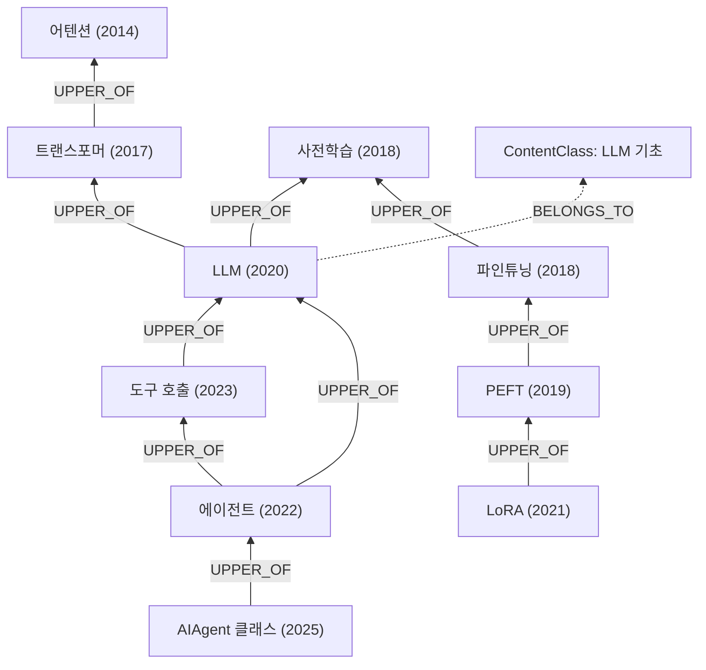

# 용어 및 개념 사전 (dict/)

`hermes-agent-gyu100` 저장소를 이해하는 데 필요한 주요·세부 용어와 개념 **237개**를 모은 한국어 사전입니다. 모든 항목은 서로 링크로 연결되어 있고, 전체가 하나의 **지식 그래프**(노드 = 용어, 엣지 = 관계)를 이룹니다.

## 한눈에 보기

| 항목 | 값 |
|---|---|
| 용어(`Content` 노드) | 237개 (예시 포함 118개) |
| 분류(`ContentClass` 노드) | 13개 |
| 계층 엣지 `UPPER_OF` | 221개 |
| 관련 엣지 `RELATED_TO` | 374개 |
| 언급 엣지 `MENTIONS` | 30개 |
| 분류 엣지 `BELONGS_TO` | 237개 |
| 계층의 뿌리(하위 개념이 없는 근본 개념) | 44개 |

## 목차

1. [사전 사용법](#사전-사용법)
2. [설계 이념](#설계-이념)
3. [노드와 엣지 모델](#노드와-엣지-모델)
4. [지식 그래프 구조 예시](#지식-그래프-구조-예시)
5. [분류(Content Class)](#분류content-class)
6. [계층의 뿌리 — 근본 개념들](#계층의-뿌리--근본-개념들)
7. [가장 많이 참조되는 용어](#가장-많이-참조되는-용어)
8. [전체 용어 색인 (가나다·ABC순)](#전체-용어-색인-가나다abc순)

그래프 DB 전환용 데이터(CSV·Cypher·GraphML·JSON)는 [graph/](graph/README.md)에 있습니다.

## 사전 사용법

탐색 경로는 세 가지입니다.

1. **분류에서 시작** — 아래 [분류(Content Class)](#분류content-class) 표에서 관심 영역 문서로 들어가, 문서 상단의 용어 목록에서 항목으로 이동합니다.
2. **색인에서 시작** — 찾는 용어가 명확하면 [전체 용어 색인](#전체-용어-색인-가나다abc순)에서 바로 이동합니다.
3. **그래프를 따라 탐색** — 아무 항목에서나 시작해 설명 속 링크, 하위/상위 개념, 관련 용어를 따라 이동합니다. 처음 공부한다면 [계층의 뿌리](#계층의-뿌리--근본-개념들)의 근본 개념부터 상위로 올라가는 것을 권합니다.

각 용어 항목은 다음 요소로 구성됩니다.

| 요소 | 의미 |
|---|---|
| **영문 / 분류 / 최초 등장** | 영문 명칭, 소속 분류(ContentClass), 개념이 처음 생긴 연월(`origin`, 알려진 정밀도까지) |
| **설명 본문** | 정의와 이 코드베이스에서의 의미. 본문 속 파란 링크는 모두 사전의 다른 항목으로 이동합니다 |
| **예시** | 개념을 구체화한 사례. 예시는 대개 그 개념을 특수화한 것이므로 그래프 관점에서 상위 방향입니다 |
| **하위 개념(더 일반·근본)** | 이 용어를 규정하는 데 필요한 바탕 개념 — 먼저 알아두면 좋은 것들 |
| **상위 개념(이를 활용해 만든 개념)** | 이 용어를 활용해 만들어진 더 특수한 개념들 |
| **관련 용어** | 계층은 아니지만 함께 이해하면 좋은 개념 |
| **이 용어를 참조하는 항목** | 역링크 — 원래 보던 곳으로 되돌아가는 데 사용합니다 |

## 설계 이념

이 사전의 용어·개념들은 서로 관계를 맺으며 하나의 **지식 그래프**를 형성합니다.

1. **계층 방향(핵심 규칙)** — 개념 간 직접 연결은 **상위/하위** 엣지로 표현합니다. **하위로 갈수록 더 일반적(근본적)인 개념**, **상위로 갈수록 더 특수한 개념**입니다.
   - **판별 기준**: 개념 B를 규정(정의·이해)하기 위해 개념 A가 필요하면 — 즉 **B가 A를 활용해서 만들어진 개념**이면 — A가 B의 **하위**, B가 A의 **상위**입니다.
   - 예: [어텐션](01_llm_basics.md#attention)이라는 개념을 활용해 만든 것이 [트랜스포머](01_llm_basics.md#transformer)이므로(논문 제목부터 "Attention Is All You Need"), **트랜스포머가 어텐션의 상위 개념**입니다. Attention(2014) → Transformer(2017) → [LLM](01_llm_basics.md#llm)(2020) 순으로 상위로 올라갑니다.
   - 예: [파인튜닝](13_model_learning.md#fine-tuning) 위에 [PEFT](13_model_learning.md#peft), 그 위에 [LoRA](13_model_learning.md#lora)가 상위 개념으로 놓입니다.
   - **예시의 위치**: 용어 A를 설명하기 위해 용어 B를 예시로 들었다면, B는 A보다 상위에 있는 용어입니다. "Transformer를 활용한 예시는 BERT가 있습니다. BERT는 Transformer의 Encoder를 활용해 만든 모델입니다"에서 BERT가 Transformer의 상위인 것과 같습니다.
2. **최초 등장 시점(origin)** — 각 Content 노드에는 개념이 처음 생긴 연월(`origin`, 알려진 정밀도까지)을 속성으로 기록합니다. 어떤 개념을 활용해 새 개념이 만들어지는 경우가 많아 **상위/하위를 구분하는 참고 자료**가 됩니다(Attention 2014-09 → Transformer 2017-06). 단, **상위 용어가 항상 하위 용어보다 늦게 생기는 것은 아니므로** origin은 참고일 뿐, 판별의 절대 기준은 위의 개념적 의존 관계입니다.
3. **다중 연결** — 하나의 용어는 여러 용어와 동시에 연결될 수 있습니다(상위/하위 엣지는 연결마다 각각 정의됩니다). 계층이 아닌 연결은 **관련 용어**로, 정의 본문 속 언급은 **참조 링크**로 표현합니다. 서로 연결되지 않는 독립 개념도 있습니다.
4. **노드 명(label)** — 노드의 역할을 규정하는 분류 체계를 둡니다.
   - `Content` — 사전을 구성하는 용어/개념 노드 (이 사전의 모든 항목)
   - `ContentClass` — Content의 분류 정보를 갖는 노드. 모든 Content는 상위/하위와는 다른 **BELONGS_TO**(이 class에 속함) 엣지로 최소 1개의 ContentClass에 연결됩니다.

> **시행착오 기록** — 초기 버전(v2)에서는 "어텐션이 트랜스포머의 상위"처럼 계층 방향이 뒤집힌 항목들이 있었습니다. "A를 구성 요소로 포함한다"를 상위로 오해한 것이 원인이었고, v3에서 **"B가 A를 활용해 만들어졌으면 B가 상위"** 기준으로 237개 용어의 계층을 전수 재검토해 바로잡았습니다. 같은 이유로 JSON-RPC→MCP, WebSocket→CDP, 네임스페이스·cgroups→컨테이너, 역색인→FTS, TF-IDF→BM25 등도 방향을 수정했습니다.

## 노드와 엣지 모델

### 노드 명(label)과 속성

| Label | 의미 | 개수 |
|---|---|---|
| `Content` | 사전을 구성하는 용어/개념 노드 | 237 |
| `ContentClass` | Content의 분류 정보를 갖는 노드 | 13 |

Content 노드 속성: `id`(고유 식별자), `name_ko`, `name_en`, `category`, `origin`(최초 등장 연월 — 참고 속성), `definition`.

### 엣지(관계) 종류와 정의

노드 간 연결은 아래 4종류의 방향성 엣지로 표현합니다.

| 엣지 | 방향 | 정의 | 문서에서의 표시 |
|---|---|---|---|
| `UPPER_OF` | (더 특수한 개념) → (더 일반적인 개념) | **계층 엣지.** source가 target을 **활용해 만들어진 상위 개념**임을 뜻합니다. 예: `(트랜스포머)-[:UPPER_OF]->(어텐션)`, `(LoRA)-[:UPPER_OF]->(PEFT)` | 각 항목의 "하위 개념(더 일반·근본)" = 이 항목이 UPPER_OF로 가리키는 대상, "상위 개념(이를 활용해 만든 개념)" = 이 항목을 UPPER_OF로 가리키는 항목들 |
| `RELATED_TO` | (정의한 쪽) → (대상) | 계층(활용/의존) 관계는 아니지만 함께 이해하면 좋은 **관련 개념**. 예: `(어텐션)-[:RELATED_TO]->(컨텍스트 윈도우)` | 각 항목의 "관련 용어" |
| `MENTIONS` | (정의한 쪽) → (언급된 용어) | 정의·예시 본문에서 링크로 **언급**되지만 상위·하위/관련으로는 분류하지 않은 참조 | 설명 본문 속 클릭 가능한 용어 링크 |
| `BELONGS_TO` | `Content` → `ContentClass` | 해당 **분류(class)에 속한다**는 의미의 전용 엣지. 계층(상위/하위) 엣지가 아니며, 모든 Content는 최소 1개의 ContentClass에 연결됩니다 | 각 항목의 "분류" |

용어 간 그래프 데이터(그래프 DB 전환용)는 [graph/](graph/README.md)에 CSV·Cypher·GraphML·JSON 형식으로 저장되어 있습니다.

## 지식 그래프 구조 예시

아래는 사전 일부를 발췌한 구조 예시입니다. 화살표는 `UPPER_OF`(상위 → 하위) 방향이고, 점선은 `BELONGS_TO`입니다.

위로 올라갈수록(그림의 위쪽) 기존 개념을 활용해 만든 더 특수한 개념이 됩니다. 하나의 노드가 여러 노드와 동시에 연결될 수 있음(예: 에이전트 → LLM, 도구 호출)도 보입니다.

## 분류(Content Class)

| 분류 | 용어 수 | 대표 용어 |
|---|---|---|
| [LLM 기초](01_llm_basics.md) | 27 | [LLM (대규모 언어 모델)](01_llm_basics.md#llm) · [프롬프트 캐싱](01_llm_basics.md#prompt-caching) · [컨텍스트 윈도우](01_llm_basics.md#context-window) |
| [에이전트 코어·대화 루프](02_agent_core.md) | 31 | [에이전트](02_agent_core.md#agent) · [도구 호출 (함수 호출)](02_agent_core.md#tool-calling) · [도구 호출 루프](02_agent_core.md#tool-calling-loop) |
| [도구 시스템](03_tool_system.md) | 24 | [도구](03_tool_system.md#tool) · [디스패치](03_tool_system.md#dispatch) · [코어 도구](03_tool_system.md#core-tools) |
| [프롬프트·컨텍스트](04_prompt_context.md) | 15 | [컨텍스트 압축](04_prompt_context.md#context-compression) · [시스템 프롬프트 3계층](04_prompt_context.md#system-prompt-tiers) · [SOUL.md](04_prompt_context.md#soul-md) |
| [메모리·자기개선](05_memory_self_improvement.md) | 23 | [스킬](05_memory_self_improvement.md#skill) · [메모리 (에이전트 기억)](05_memory_self_improvement.md#memory) · [메모리 제공자](05_memory_self_improvement.md#memory-provider) |
| [상태·영속성·검색](06_state_retrieval.md) | 19 | [FTS5](06_state_retrieval.md#fts5) · [SessionDB](06_state_retrieval.md#sessiondb) · [검색 증강 (RAG)](06_state_retrieval.md#retrieval) |
| [게이트웨이·인터페이스](07_gateway_interfaces.md) | 16 | [게이트웨이](07_gateway_interfaces.md#gateway) · [플랫폼 어댑터](07_gateway_interfaces.md#platform-adapter) · [HermesCLI](07_gateway_interfaces.md#hermes-cli) |
| [프로토콜·상호운용](08_protocols.md) | 19 | [MCP (모델 컨텍스트 프로토콜)](08_protocols.md#mcp) · [CDP (크롬 개발자도구 프로토콜)](08_protocols.md#cdp) · [MCP 서버](08_protocols.md#mcp-server) |
| [실행 환경·인프라](09_execution_infra.md) | 22 | [실행 환경](09_execution_infra.md#execution-environment) · [컨테이너](09_execution_infra.md#container) · [샌드박스 (격리)](09_execution_infra.md#sandbox) |
| [보안](10_security.md) | 8 | [명령 승인](10_security.md#command-approval) · [YOLO 모드](10_security.md#yolo-mode) · [하드라인 차단 목록](10_security.md#hardline-blocklist) |
| [설계 원칙·프로젝트 용어](11_design_principles.md) | 13 | [풋프린트 사다리](11_design_principles.md#footprint-ladder) · [좁은 허리 원칙](11_design_principles.md#narrow-waist) · [config.yaml](11_design_principles.md#config-yaml) |
| [크론·플러그인·부가 서브시스템](12_subsystems.md) | 10 | [플러그인](12_subsystems.md#plugin) · [크론 (예약 작업)](12_subsystems.md#cron) · [ACP 어댑터](12_subsystems.md#acp-adapter) |
| [모델 학습·적응](13_model_learning.md) | 10 | [파인튜닝 (FT)](13_model_learning.md#fine-tuning) · [사전학습](13_model_learning.md#pretraining) · [지시 튜닝](13_model_learning.md#instruction-tuning) |

## 계층의 뿌리 — 근본 개념들

하위 개념이 없는(더 이상 내려갈 곳이 없는) 근본 개념들입니다. 처음 공부한다면 여기서 시작해 상위로 올라가세요.

[CI/CD](09_execution_infra.md#ci-cd) · [E2E 검증](11_design_principles.md#e2e-validation) · [HERMES_HOME](07_gateway_interfaces.md#hermes-home) · [JSON Schema](03_tool_system.md#json-schema) · [JSON-RPC 2.0](08_protocols.md#json-rpc) · [N×M 통합 문제](08_protocols.md#nxm-problem) · [REPL](07_gateway_interfaces.md#repl) · [SQLite](06_state_retrieval.md#sqlite) · [SSE (서버 전송 이벤트)](08_protocols.md#sse) · [TF-IDF](06_state_retrieval.md#tf-idf) · [TUI (Ink)](07_gateway_interfaces.md#tui) · [VM 격리](09_execution_infra.md#vm-isolation) · [WebSocket](08_protocols.md#websocket) · [cgroups](09_execution_infra.md#cgroups) · [config.yaml](11_design_principles.md#config-yaml) · [stdio 전송](08_protocols.md#stdio) · [게이트웨이](07_gateway_interfaces.md#gateway) · [관측성](12_subsystems.md#observability) · [국제화 (i18n)](12_subsystems.md#i18n) · [도구](03_tool_system.md#tool) · [리눅스 네임스페이스](09_execution_infra.md#namespace) · [마음 이론](05_memory_self_improvement.md#theory-of-mind) · [비밀정보 분리 (.env)](10_security.md#secrets-env) · [비신뢰 콘텐츠 원칙](10_security.md#untrusted-content) · [사전학습](13_model_learning.md#pretraining) · [샌드박스 (격리)](09_execution_infra.md#sandbox) · [서버리스 컴퓨트](09_execution_infra.md#serverless) · [실행 환경](09_execution_infra.md#execution-environment) · [앙상블](02_agent_core.md#ensemble) · [어텐션](01_llm_basics.md#attention) · [역색인](06_state_retrieval.md#inverted-index) · [임베딩](01_llm_basics.md#embedding) · [재현성](09_execution_infra.md#reproducibility) · [접근성 트리](08_protocols.md#accessibility-tree) · [좁은 허리 원칙](11_design_principles.md#narrow-waist) · [지연 설치 의존성](09_execution_infra.md#lazy-deps) · [컨벤셔널 커밋](11_design_principles.md#conventional-commits) · [크론 (예약 작업)](12_subsystems.md#cron) · [탈출구 패턴](11_design_principles.md#escape-hatch) · [토큰](01_llm_basics.md#token) · [프런트매터](05_memory_self_improvement.md#frontmatter) · [플러그인](12_subsystems.md#plugin) · [행위 계약 테스트](11_design_principles.md#behavior-contract) · [헤드리스 브라우저](08_protocols.md#headless)

## 가장 많이 참조되는 용어

다른 항목에서 가장 많이 언급되는 허브(hub) 개념들입니다. 이 개념들을 익혀 두면 사전 전체가 쉬워집니다.

| 용어 | 참조 항목 수 |
|---|---|
| [LLM (대규모 언어 모델)](01_llm_basics.md#llm) | 23 |
| [도구](03_tool_system.md#tool) | 13 |
| [컨텍스트 압축](04_prompt_context.md#context-compression) | 12 |
| [에이전트](02_agent_core.md#agent) | 11 |
| [도구 호출 (함수 호출)](02_agent_core.md#tool-calling) | 10 |
| [MCP (모델 컨텍스트 프로토콜)](08_protocols.md#mcp) | 10 |
| [실행 환경](09_execution_infra.md#execution-environment) | 10 |
| [스킬](05_memory_self_improvement.md#skill) | 9 |
| [프롬프트 캐싱](01_llm_basics.md#prompt-caching) | 8 |
| [도구 호출 루프](02_agent_core.md#tool-calling-loop) | 8 |

## 전체 용어 색인 (가나다·ABC순)

- [ACP (에이전트 클라이언트 프로토콜)](08_protocols.md#acp) — Agent Client Protocol
- [ACP 어댑터](12_subsystems.md#acp-adapter) — ACP Adapter
- [AIAgent 클래스](02_agent_core.md#aiagent) — AIAgent (run_agent.py)
- [API 서버 어댑터](07_gateway_interfaces.md#api-server) — API Server Adapter
- [AST 기반 도구 발견](03_tool_system.md#ast-discovery) — AST-based Discovery
- [BM25](06_state_retrieval.md#bm25) — BM25 (Okapi)
- [CDP (크롬 개발자도구 프로토콜)](08_protocols.md#cdp) — Chrome DevTools Protocol
- [CDP 도메인](08_protocols.md#cdp-domain) — CDP Domains
- [CI/CD](09_execution_infra.md#ci-cd) — CI/CD
- [Daytona 백엔드](09_execution_infra.md#daytona-backend) — Daytona Backend
- [Docker 백엔드](09_execution_infra.md#docker-backend) — Docker Backend
- [E2E 검증](11_design_principles.md#e2e-validation) — E2E Validation
- [FTS 동기화 트리거](06_state_retrieval.md#fts-trigger) — FTS Sync Triggers
- [FTS5](06_state_retrieval.md#fts5) — FTS5
- [HERMES_HOME](07_gateway_interfaces.md#hermes-home) — HERMES_HOME
- [HermesCLI](07_gateway_interfaces.md#hermes-cli) — HermesCLI
- [Honcho](05_memory_self_improvement.md#honcho) — Honcho
- [JSON Schema](03_tool_system.md#json-schema) — JSON Schema
- [JSON-RPC 2.0](08_protocols.md#json-rpc) — JSON-RPC 2.0
- [KV 캐시](01_llm_basics.md#kv-cache) — KV Cache
- [LLM (대규모 언어 모델)](01_llm_basics.md#llm) — Large Language Model
- [LLM 심판](02_agent_core.md#llm-as-judge) — LLM-as-a-Judge
- [LLM 제공자](02_agent_core.md#provider) — LLM Provider
- [LSP (언어 서버 프로토콜)](08_protocols.md#lsp) — Language Server Protocol
- [LoRA](13_model_learning.md#lora) — Low-Rank Adaptation
- [MCP (모델 컨텍스트 프로토콜)](08_protocols.md#mcp) — Model Context Protocol
- [MCP 서버](08_protocols.md#mcp-server) — MCP Server
- [MCP 전송 계층](08_protocols.md#mcp-transport) — MCP Transports
- [MCP 클라이언트](08_protocols.md#mcp-client) — MCP Client
- [MCP 프리미티브](08_protocols.md#mcp-primitives) — MCP Primitives
- [Mixture-of-Agents (MoA)](02_agent_core.md#moa) — Mixture-of-Agents
- [Mixture-of-Experts (MoE)](02_agent_core.md#moe) — Mixture-of-Experts
- [Modal 백엔드](09_execution_infra.md#modal-backend) — Modal Backend
- [Nix / Flake](09_execution_infra.md#nix) — Nix
- [Nous Portal](11_design_principles.md#nous-portal) — Nous Portal
- [N×M 통합 문제](08_protocols.md#nxm-problem) — N×M Integration Problem
- [PEFT (파라미터 효율 파인튜닝)](13_model_learning.md#peft) — Parameter-Efficient Fine-Tuning
- [REPL](07_gateway_interfaces.md#repl) — REPL
- [RLHF (인간 피드백 강화학습)](13_model_learning.md#rlhf) — RLHF
- [ReAct 패턴](02_agent_core.md#react) — ReAct (Reason + Act)
- [SKILL.md](05_memory_self_improvement.md#skill-md) — SKILL.md
- [SOUL.md](04_prompt_context.md#soul-md) — SOUL.md
- [SQLite](06_state_retrieval.md#sqlite) — SQLite
- [SSE (서버 전송 이벤트)](08_protocols.md#sse) — Server-Sent Events
- [SSH 백엔드](09_execution_infra.md#ssh-backend) — SSH Backend
- [SessionDB](06_state_retrieval.md#sessiondb) — SessionDB
- [Singularity/Apptainer 백엔드](09_execution_infra.md#singularity-backend) — Singularity Backend
- [Streamable HTTP](08_protocols.md#streamable-http) — Streamable HTTP
- [TF-IDF](06_state_retrieval.md#tf-idf) — TF-IDF
- [TUI (Ink)](07_gateway_interfaces.md#tui) — TUI
- [TUI 게이트웨이](07_gateway_interfaces.md#tui-gateway) — TUI Gateway
- [VM 격리](09_execution_infra.md#vm-isolation) — VM Isolation
- [WAL 모드](06_state_retrieval.md#wal) — Write-Ahead Logging
- [WebSocket](08_protocols.md#websocket) — WebSocket
- [YOLO 모드](10_security.md#yolo-mode) — YOLO Mode
- [browser_cdp (CDP 탈출구)](03_tool_system.md#browser-cdp-tool) — browser_cdp Tool
- [cgroups](09_execution_infra.md#cgroups) — Control Groups
- [config.yaml](11_design_principles.md#config-yaml) — config.yaml
- [delegate 도구](03_tool_system.md#delegate-tool) — Delegate Tool
- [run_conversation 루프](02_agent_core.md#run-conversation) — run_conversation
- [stdio 전송](08_protocols.md#stdio) — stdio Transport
- [tool_call_id](02_agent_core.md#tool-call-id) — tool_call_id
- [unicode61 토크나이저](06_state_retrieval.md#unicode61) — unicode61
- [가용성 검사 (check_fn)](03_tool_system.md#check-fn) — check_fn (Service Gating)
- [검색 증강 (RAG)](06_state_retrieval.md#retrieval) — Retrieval / RAG
- [게이트웨이](07_gateway_interfaces.md#gateway) — Gateway
- [게이트웨이 세션](07_gateway_interfaces.md#gateway-session) — Gateway Session Context
- [결과 정규화](03_tool_system.md#result-normalization) — Result Normalization
- [관리형 도구](11_design_principles.md#managed-tools) — Managed Tools
- [관측성](12_subsystems.md#observability) — Observability
- [구조화 요약](04_prompt_context.md#structured-summary) — Structured Summary
- [구조화 출력](01_llm_basics.md#structured-output) — Structured Output
- [국제화 (i18n)](12_subsystems.md#i18n) — Internationalization
- [그라운딩](01_llm_basics.md#grounding) — Grounding
- [그레이스 콜](02_agent_core.md#grace-call) — Grace Call
- [기능 협상](08_protocols.md#capability-negotiation) — Capability Negotiation
- [다중 에이전트 시스템](02_agent_core.md#multi-agent) — Multi-Agent System
- [데스크톱 앱 (Electron)](07_gateway_interfaces.md#desktop-app) — Desktop App
- [델리게이션 (작업 위임)](02_agent_core.md#delegation) — Delegation
- [도구](03_tool_system.md#tool) — Tool
- [도구 결과 크기 상한](03_tool_system.md#max-result-size) — Max Result Size
- [도구 레지스트리](03_tool_system.md#tool-registry) — Tool Registry
- [도구 스키마](03_tool_system.md#tool-schema) — Tool Schema
- [도구 중독](10_security.md#tool-poisoning) — Tool Poisoning
- [도구 출력 가지치기](04_prompt_context.md#tool-output-pruning) — Tool Output Pruning
- [도구 호출 (함수 호출)](02_agent_core.md#tool-calling) — Tool Calling / Function Calling
- [도구 호출 루프](02_agent_core.md#tool-calling-loop) — Tool-Calling Loop
- [디스패치](03_tool_system.md#dispatch) — Dispatch
- [딜리버리 (출력 라우팅)](07_gateway_interfaces.md#delivery) — Delivery
- [레이트리밋](01_llm_basics.md#rate-limit) — Rate Limit
- [루트리스 컨테이너](09_execution_infra.md#rootless) — Rootless Container
- [루프 종료 조건](02_agent_core.md#agent-loop-termination) — Loop Termination
- [리눅스 네임스페이스](09_execution_infra.md#namespace) — Linux Namespaces
- [마음 이론](05_memory_self_improvement.md#theory-of-mind) — Theory of Mind
- [머리/꼬리 보호](04_prompt_context.md#head-tail-protection) — Head/Tail Protection
- [멀티모달](01_llm_basics.md#multimodal) — Multimodal
- [메모리 (에이전트 기억)](05_memory_self_improvement.md#memory) — Agent Memory
- [메모리 도구](05_memory_self_improvement.md#memory-tool) — Memory Tool
- [메모리 매니저](05_memory_self_improvement.md#memory-manager) — Memory Manager
- [메모리 제공자](05_memory_self_improvement.md#memory-provider) — Memory Provider
- [메시지 프로토콜](02_agent_core.md#message-protocol) — Message Protocol (roles)
- [명령 승인](10_security.md#command-approval) — Command Approval
- [모델 메타데이터](02_agent_core.md#model-metadata) — Model Metadata
- [반복 예산](02_agent_core.md#iteration-budget) — Iteration Budget
- [배치 러너](12_subsystems.md#batch-runner) — Batch Runner
- [벡터 검색](06_state_retrieval.md#vector-search) — Vector Search
- [벤치마크 (평가)](13_model_learning.md#benchmark) — Benchmark
- [변경 감지 테스트 (안티패턴)](11_design_principles.md#change-detector) — Change-Detector Tests
- [변증법적 API](05_memory_self_improvement.md#dialectic-api) — Dialectic API
- [병렬 도구 호출](02_agent_core.md#parallel-tool-calls) — Parallel Tool Calls
- [보관 (비파괴 정리)](05_memory_self_improvement.md#archive) — Archive (Non-Destructive)
- [보조 모델](01_llm_basics.md#auxiliary-model) — Auxiliary Model
- [브라우저 도구](03_tool_system.md#browser-tool) — Browser Tool
- [비밀정보 분리 (.env)](10_security.md#secrets-env) — Secrets in .env
- [비신뢰 콘텐츠 원칙](10_security.md#untrusted-content) — Untrusted Content
- [비전 도구](03_tool_system.md#vision-tools) — Vision Tools
- [비전 모델 (VLM)](01_llm_basics.md#vision-model) — Vision-Language Model
- [사용자 모델링](05_memory_self_improvement.md#user-modeling) — User Modeling
- [사전학습](13_model_learning.md#pretraining) — Pre-training
- [새니타이즈](10_security.md#sanitization) — Sanitization
- [샌드박스 (격리)](09_execution_infra.md#sandbox) — Sandbox / Isolation
- [샘플링 / 온도](01_llm_basics.md#sampling) — Sampling / Temperature
- [서버리스 컴퓨트](09_execution_infra.md#serverless) — Serverless Compute
- [서브에이전트 / 위임](02_agent_core.md#subagent) — Subagent / Delegation
- [설정 마법사](11_design_principles.md#setup-wizard) — Setup Wizard
- [세션](06_state_retrieval.md#session) — Session
- [세션 검색](06_state_retrieval.md#session-search) — Session Search
- [세션 스냅샷 (셸 상태)](09_execution_infra.md#session-snapshot) — Session Snapshot
- [스킨 (CLI 테마)](11_design_principles.md#skin) — Skin
- [스킬](05_memory_self_improvement.md#skill) — Skill
- [스킬 고정](05_memory_self_improvement.md#pinning) — Skill Pinning
- [스킬 도구 (skill_view)](03_tool_system.md#skill-tool) — Skill Tools
- [스킬 허브](05_memory_self_improvement.md#skills-hub) — Skills Hub
- [슬래시 명령](07_gateway_interfaces.md#slash-command) — Slash Command
- [시스템 프롬프트](01_llm_basics.md#system-prompt) — System Prompt
- [시스템 프롬프트 3계층](04_prompt_context.md#system-prompt-tiers) — System Prompt Tiers
- [실행 환경](09_execution_infra.md#execution-environment) — Execution Environment
- [압축 계보](04_prompt_context.md#compression-lineage) — Compression Lineage (parent_session_id)
- [압축 쿨다운](04_prompt_context.md#compression-cooldown) — Compression Cooldown
- [앙상블](02_agent_core.md#ensemble) — Ensemble
- [양자화](13_model_learning.md#quantization) — Quantization
- [어텐션](01_llm_basics.md#attention) — Attention
- [에러 봉투](03_tool_system.md#error-envelope) — Error Envelope
- [에이전트](02_agent_core.md#agent) — Agent
- [에이전트형 RAG](06_state_retrieval.md#agentic-rag) — Agentic RAG
- [역색인](06_state_retrieval.md#inverted-index) — Inverted Index
- [역할 교대 불변식](02_agent_core.md#role-alternation) — Role Alternation
- [오케스트레이션](02_agent_core.md#orchestration) — Orchestration
- [오픈 웨이트 모델](13_model_learning.md#open-weights) — Open-Weights Model
- [옵션 스킬](05_memory_self_improvement.md#optional-skills) — Optional Skills
- [외부 콘텐츠 테이블](06_state_retrieval.md#external-content) — External-Content FTS Table
- [요약 기반 압축](04_prompt_context.md#summarization) — Summarization
- [원격 파일 동기화](09_execution_infra.md#file-sync) — Remote File Sync
- [웹 검색 도구](03_tool_system.md#web-search-tool) — Web Search Tool
- [웹 대시보드](07_gateway_interfaces.md#web-dashboard) — Web Dashboard
- [웹훅](07_gateway_interfaces.md#webhook) — Webhook
- [음성 모드](03_tool_system.md#voice-mode) — Voice Mode
- [음성 인식 (STT)](01_llm_basics.md#stt) — Speech-to-Text
- [음성 합성 (TTS)](01_llm_basics.md#tts) — Text-to-Speech
- [응답 스트리밍](01_llm_basics.md#streaming) — Streaming
- [의미 기억](05_memory_self_improvement.md#semantic-memory) — Semantic Memory
- [의존성 정확 고정](09_execution_infra.md#exact-pinning) — Exact Pinning
- [일화 기억](05_memory_self_improvement.md#episodic-memory) — Episodic Memory
- [임베딩](01_llm_basics.md#embedding) — Embedding
- [자기 등록](03_tool_system.md#self-registration) — Self-Registration
- [자기 성찰](05_memory_self_improvement.md#self-reflection) — Self-Reflection
- [자기개선 에이전트](05_memory_self_improvement.md#self-improving-agent) — Self-Improving Agent
- [자기일관성](02_agent_core.md#self-consistency) — Self-Consistency
- [자율성 수준](02_agent_core.md#autonomy) — Autonomy Level
- [재시도와 폴백](02_agent_core.md#retry-fallback) — Retry & Fallback
- [재현성](09_execution_infra.md#reproducibility) — Reproducibility
- [전문 검색 (FTS)](06_state_retrieval.md#fts) — Full-Text Search
- [절차 기억](05_memory_self_improvement.md#procedural-memory) — Procedural Memory
- [점진적 공개](05_memory_self_improvement.md#progressive-disclosure) — Progressive Disclosure
- [접근성 트리](08_protocols.md#accessibility-tree) — Accessibility Tree
- [제공자별 캐시 구현](01_llm_basics.md#context-caching-provider) — Provider Cache Implementations
- [제안자/종합자](02_agent_core.md#proposer-aggregator) — Proposer / Aggregator
- [제약 디코딩](01_llm_basics.md#constrained-decoding) — Constrained Decoding
- [좁은 허리 원칙](11_design_principles.md#narrow-waist) — Narrow Waist
- [중간 소실 현상](04_prompt_context.md#lost-in-the-middle) — Lost in the Middle
- [지수 백오프](01_llm_basics.md#backoff) — Exponential Backoff
- [지시 튜닝](13_model_learning.md#instruction-tuning) — Instruction Tuning
- [지식 증류](13_model_learning.md#distillation) — Knowledge Distillation
- [지연 설치 의존성](09_execution_infra.md#lazy-deps) — Lazy Dependencies
- [지연 시간](01_llm_basics.md#latency) — Latency
- [추론 (서빙)](01_llm_basics.md#inference) — Inference / Serving
- [추론 모델 / 사고 과정](01_llm_basics.md#reasoning-model) — Reasoning Model / Chain-of-Thought
- [칸반 (다중 에이전트 보드)](02_agent_core.md#kanban) — Kanban
- [컨벤셔널 커밋](11_design_principles.md#conventional-commits) — Conventional Commits
- [컨테이너](09_execution_infra.md#container) — Container
- [컨테이너 이미지](09_execution_infra.md#container-image) — Container Image
- [컨텍스트 압축](04_prompt_context.md#context-compression) — Context Compression
- [컨텍스트 엔지니어링](04_prompt_context.md#context-engineering) — Context Engineering
- [컨텍스트 엔진](04_prompt_context.md#context-engine) — Context Engine
- [컨텍스트 윈도우](01_llm_basics.md#context-window) — Context Window
- [컨텍스트 파일 (AGENTS.md)](04_prompt_context.md#context-file) — Context Files
- [컴퓨터 사용](03_tool_system.md#computer-use) — Computer Use
- [코어 도구](03_tool_system.md#core-tools) — Core Tools (_HERMES_CORE_TOOLS)
- [큐레이터](05_memory_self_improvement.md#curator) — Curator
- [크론 (예약 작업)](12_subsystems.md#cron) — Cron / Scheduled Tasks
- [크론 스케줄러](12_subsystems.md#cron-scheduler) — Cron Scheduler
- [크리덴셜 풀](02_agent_core.md#credential-pool) — Credential Pool
- [클라우드 브라우저](08_protocols.md#cloud-browser) — Cloud Browser
- [탈출구 패턴](11_design_principles.md#escape-hatch) — Escape Hatch
- [터미널 도구](03_tool_system.md#terminal-tool) — Terminal Tool
- [턴](02_agent_core.md#turn) — Turn
- [턴 격리](11_design_principles.md#turn-isolation) — Turn Isolation
- [토크나이저 (검색)](06_state_retrieval.md#tokenizer) — Tokenizer (FTS)
- [토큰](01_llm_basics.md#token) — Token
- [토큰 예산 기반 꼬리 보호](04_prompt_context.md#token-budget-tail) — Token-Budget Tail Protection
- [통합 세션](07_gateway_interfaces.md#unified-inbox) — Unified Session
- [툴셋](03_tool_system.md#toolset) — Toolset
- [트라이그램 토크나이저](06_state_retrieval.md#trigram) — Trigram
- [트래젝토리 (실행 궤적)](12_subsystems.md#trajectory) — Trajectory
- [트랜스포머](01_llm_basics.md#transformer) — Transformer
- [트리아지 스위퍼](12_subsystems.md#triage-sweeper) — Triage Sweeper
- [파인튜닝 (FT)](13_model_learning.md#fine-tuning) — Fine-Tuning
- [파일 도구](03_tool_system.md#file-tools) — File Tools
- [페르소나](04_prompt_context.md#persona) — Persona
- [풋프린트 사다리](11_design_principles.md#footprint-ladder) — Footprint Ladder
- [프런트매터](05_memory_self_improvement.md#frontmatter) — Frontmatter
- [프로필](07_gateway_interfaces.md#profile) — Profile
- [프롬프트](01_llm_basics.md#prompt) — Prompt
- [프롬프트 인젝션](10_security.md#prompt-injection) — Prompt Injection
- [프롬프트 캐싱](01_llm_basics.md#prompt-caching) — Prompt Caching
- [플랫폼 어댑터](07_gateway_interfaces.md#platform-adapter) — Platform Adapter
- [플러그인](12_subsystems.md#plugin) — Plugin
- [플러그인 훅](12_subsystems.md#plugin-hook) — Plugin Hooks
- [하드라인 차단 목록](10_security.md#hardline-blocklist) — Hardline Blocklist
- [하이브리드 검색](06_state_retrieval.md#hybrid-search) — Hybrid Search
- [학습 프롬프트](05_memory_self_improvement.md#learn-prompt) — Learn Prompt
- [핸들러](03_tool_system.md#handler) — Handler
- [행위 계약 테스트](11_design_principles.md#behavior-contract) — Behavior Contract Tests
- [헤드리스 브라우저](08_protocols.md#headless) — Headless Browser
- [호출별 스폰 모델](09_execution_infra.md#spawn-per-call) — Spawn-per-Call
- [환각](01_llm_basics.md#hallucination) — Hallucination
- [휴먼 인 더 루프](02_agent_core.md#human-in-the-loop) — Human-in-the-Loop
