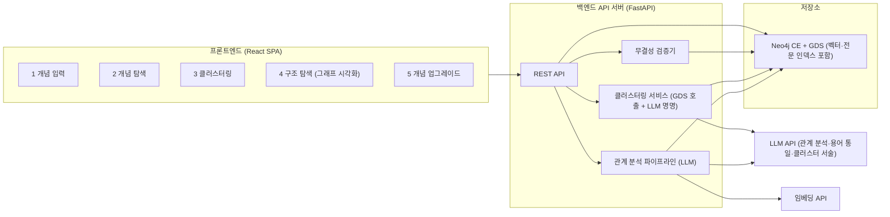
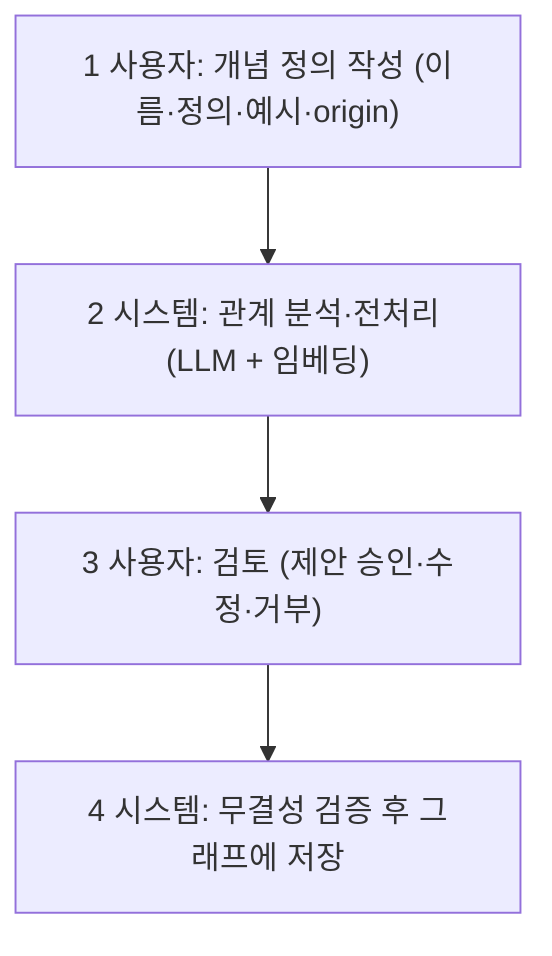
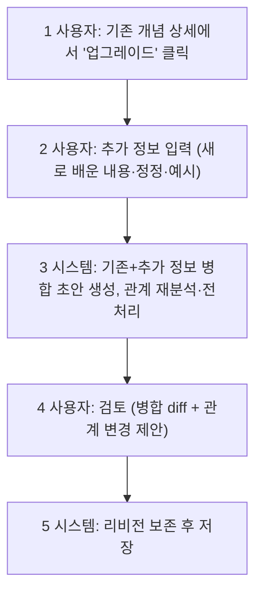

# Concept Vault — 개념 학습 저장·검증·탐색 서비스 설계 문서

개인이 공부하고 습득한 **개념(Concept)** 을 지식 그래프에 저장하고, 정확하게 학습했는지
**검증**하며, 나중에 **탐색·복습**할 수 있게 해주는 서비스의 설계 문서입니다.

이 설계는 `nanobot-gyu100/dict/`와 `hermes-agent-gyu100/dict/` 두 지식 그래프 구축
프로젝트(첨부 자료 dict1·dict2)의 설계 사상·시행착오·노하우를 철저히 분석해 종합하고,
서비스화에 필요한 개선을 더한 것입니다. 첨부 자료에서 `Content`로 표기된 노드는 이
문서에서 서비스 도메인에 맞게 **`Concept`** 으로 명명합니다.

## 목차

1. [서비스 개요와 목표](#1-서비스-개요와-목표)
2. [참고 자료(dict1·dict2) 분석 요약](#2-참고-자료dict1dict2-분석-요약)
3. [오픈소스 지식 그래프 DB 선정](#3-오픈소스-지식-그래프-db-선정)
4. [지식 그래프 모델 (종합·개선안)](#4-지식-그래프-모델-종합개선안)
5. [시스템 아키텍처](#5-시스템-아키텍처)
6. [기능 1 — 신규 개념 입력](#6-기능-1--신규-개념-입력)
7. [기능 2 — 개념 탐색(검색)](#7-기능-2--개념-탐색검색)
8. [기능 3 — 저장 개념 클러스터링](#8-기능-3--저장-개념-클러스터링)
9. [기능 4 — 개념 구조 탐색(시각화)](#9-기능-4--개념-구조-탐색시각화)
10. [기능 5 — 개념 업그레이드](#10-기능-5--개념-업그레이드)
11. [API 설계 요약](#11-api-설계-요약)
12. [데이터 무결성·검증 규칙](#12-데이터-무결성검증-규칙)
13. [구현 로드맵](#13-구현-로드맵)

---

## 1. 서비스 개요와 목표

### 1.1 핵심 컨셉

> **"공부한 개념을 저장하고 — 정확하게 학습했는지 검증하고 — 나중에 탐색·복습하는 공간."**

- **저장(Store)**: 사용자가 자기 언어로 작성한 개념 정의를 지식 그래프의 노드로 저장.
- **검증(Verify)**: 저장 전에 LLM이 기존 그래프와의 관계를 분석하고 분류·계층·용어 통일을
  제안하면, 사용자가 검토·승인. 이 과정 자체가 "내가 이 개념을 다른 개념들과의 관계 속에서
  정확히 이해했는가"를 검증하는 학습 장치가 됨.
- **탐색·복습(Explore & Review)**: 키워드·서술형 검색, 클러스터 기반 구조 시각화, 계층
  사슬 따라가기(기반 개념으로 내려가기 / 파생 개념으로 올라가기)로 복습.

### 1.2 설계 원칙

1. **그래프가 곧 사전이다** — 개념 정의(문서)와 그래프 데이터는 항상 같은 원본에서
   파생되어야 하며 손으로 따로 관리하지 않는다. (dict2 교훈: 손 편집 불일치)
2. **계층은 의미 분석으로 결정한다** — 링크·언급 여부가 아니라 "어느 개념이 어느 개념을
   기반으로 만들어졌는가"로 판정한다. (dict1 v2→v3 교훈)
3. **저장 전 사용자 검토는 필수다** — LLM의 관계 분석은 제안일 뿐, 최종 확정은 항상
   사용자가 한다. 검토 없는 자동 저장은 하지 않는다.
4. **비파괴 원칙** — 개념 업그레이드·용어 통일 시 이전 상태를 리비전으로 보존한다.
5. **불변 조건은 기계가 검증한다** — 저장 트랜잭션마다 클래스 연결·순환·중복 검사를
   자동 수행한다.

---

## 2. 참고 자료(dict1·dict2) 분석 요약

두 자료는 각각 nanobot(246개 용어)·hermes(237개 용어) 코드베이스의 용어·개념 사전을
지식 그래프로 구축한 결과물로, 같은 설계 사상의 두 구현입니다.

### 2.1 공통 사상 (그대로 계승)

| 항목 | 내용 |
|---|---|
| 노드 2종 | `Content`(용어·개념) + `ContentClass`(역할 분류). 모든 Content는 최소 1개 클래스에 `BELONGS_TO` |
| 계층 방향 규약 | **하위 = 더 일반·근본(기반·전제), 상위 = 더 특수(파생)**. 엣지는 `(파생/특수) → (기반/일반)` 한 방향으로 저장 (dict1: `SPECIALIZES`, dict2: `UPPER_OF` — 이름만 다르고 의미 동일) |
| 계층 판정 기준 | "B가 A를 **활용해 만들어졌으면** B가 상위". 대표 사슬: `BERT → Transformer → Attention`, `LoRA → PEFT → Fine-tuning` |
| 판정 절차 4단계 | ① B가 A를 활용해 만들어졌는가 → SPECIALIZES ② A의 정의에 B가 필수인가 → 역방향 SPECIALIZES ③ 계층은 아니나 밀접한가 → `RELATED_TO` ④ 본문 언급뿐인가 → `MENTIONS` (계층으로 승격 금지) |
| 최초 등장 시기 | `first_appearance`/`origin`은 **참고 속성**일 뿐 계층의 절대 기준이 아님. 알려진 정밀도까지만 기록, 지어내지 않음 |
| 다중 연결 | 한 개념은 여러 개념과 동시에 연결 가능. 연결 없는 독립 개념도 허용 |

### 2.2 시행착오 (반복 금지 목록)

1. **v1 — 방향 규약 모호**: `HAS_SUBCONCEPT`(상위→하위) 분류 트리 관점으로 시작해 방향이
   흔들림 → "하위=일반, 상위=특수" 규약으로 정착.
2. **v2 — 링크 등장 = 상위로 기계 적용**: "설명 속 예시 = 상위"를 링크 등장 여부만으로
   적용해 Self-Attention을 Transformer의 상위로 두는 오류. "포함/구성"을 "활용/의존"으로
   오해한 같은 유형의 오류가 광범위(JSON-RPC→MCP, WebSocket→CDP, 역색인→FTS 등).
3. **origin으로 계층을 결정하려는 유혹**: 시간 순서는 대체로 의존 방향과 일치하지만 항상은
   아님 → 참고로만.
4. **up 필드 ↔ UPPER_OF 엣지 방향 혼동**: 필드명과 엣지명이 반대로 읽히기 쉬움 → 문서·코드
   주석에 방향 명시.
5. **손 편집 불일치 / 통계 하드코딩**: 생성물 직접 수정·숫자 하드코딩은 즉시 낡음 → 원본
   데이터에서 자동 산출.
6. **rel/up 중복**: 같은 쌍이 계층과 관련에 중복되면 안 됨(계층 우선).
7. **UPPER_OF 순환**: 순환이 있으면 방향을 잘못 잡은 것 → 순환 검사 0 필수.

### 2.3 서비스화를 위한 개선점 (이 설계에서 추가)

두 자료는 "사람+LLM이 오프라인 배치로 구축한 정적 산출물"입니다. 이를 **사용자가
상시적으로 입력·검증·탐색하는 온라인 서비스**로 발전시키기 위해 다음을 더합니다.

| 개선 | 근거 |
|---|---|
| **초안(draft)/승인(approved) 상태 분리** | 사용자 검토 전 LLM 제안을 그래프 본체와 격리 (기능 1·5의 검토 단계) |
| **별칭 처리(`ALIAS_OF`) + 임베딩 유사도 기반 중복 탐지** | "기존에 등록된 개념을 다른 이름으로 저장" 문제를 등록 시점에 자동 탐지 — 자료에서는 사람이 수작업으로 통일 |
| **리비전(`ConceptRevision`) 보존** | 업그레이드(기능 5) 시 학습 이력 추적·복원 |
| **클러스터 노드(`Cluster`) 1급 시민화** | 자료의 ContentClass는 수작업 고정 분류 — 여기에 그래프 구조 기반 자동 클러스터링(기능 3)을 별도 축으로 추가 |
| **벡터 인덱스 + 전문(full-text) 인덱스 상시 유지** | 서술형 검색(기능 2)과 중복 탐지의 기반 |
| **저장 트랜잭션마다 무결성 자동 검증** | 자료의 "검증 체크리스트"를 사람이 아닌 시스템이 매번 수행 |

---

## 3. 오픈소스 지식 그래프 DB 선정

### 3.1 후보 비교

| 후보 | 라이선스 | 쿼리 언어 | 그래프 알고리즘(클러스터링) | 벡터 검색 | 전문 검색 | 시각화 생태계 | 비고 |
|---|---|---|---|---|---|---|---|
| **Neo4j Community Edition** | GPLv3 (오픈소스) | Cypher | **GDS 라이브러리(Louvain·Leiden·WCC 등, CE에서 사용 가능)** | **네이티브 벡터 인덱스(5.13+)** | 네이티브 full-text(Lucene) | Neo4j Browser, Bloom 대체 오픈 도구 다수, 드라이버 전 언어 | 첨부 자료의 `import.cypher`/CSV가 그대로 임포트됨 |
| Memgraph | BSL 1.1 (소스 공개형, 순수 오픈소스 아님) | Cypher | MAGE(커뮤니티 알고리즘) | 있음 | 있음 | Memgraph Lab | 빠르지만 라이선스가 "가장 좋은 오픈소스" 기준에 미달 |
| JanusGraph | Apache 2.0 | Gremlin | 외부(Spark) 연계 필요 | 외부 인덱스(ES) 연계 | 외부(ES) 연계 | 약함 | 수평 확장용 — 개인 학습 서비스엔 과대·운영 복잡 |
| Apache AGE (PostgreSQL 확장) | Apache 2.0 | Cypher(부분) | 없음(직접 구현) | pgvector 병용 | PG FTS 병용 | 약함 | PG 자산 재활용에는 좋으나 Cypher 지원 부분적, 그래프 알고리즘 부재 |
| NebulaGraph | Apache 2.0 | nGQL | 별도 분석 컴포넌트 | 제한적 | 제한적 | 보통 | 분산 대규모용 — 과대 |
| Kùzu | MIT | Cypher | 일부 | 있음 | 있음 | 초기 단계 | 임베디드로 매력적이나 생태계·알고리즘 성숙도 낮음 |

### 3.2 선정: **Neo4j Community Edition (+ Graph Data Science 라이브러리)**

선정 이유:

1. **본 서비스의 5개 기능을 한 시스템으로 전부 충족** — 계층 탐색(Cypher 가변 길이 경로),
   서술형 검색(네이티브 벡터 인덱스), 키워드 검색(네이티브 full-text 인덱스), 클러스터링
   (GDS의 Louvain/Leiden — 기능 3의 핵심), 시각화(Bolt 프로토콜 + JS 생태계).
2. **첨부 자료와의 직접 호환** — dict1·dict2의 그래프 데이터가 Neo4j 임포트 형식
   (`nodes.csv`/`edges.csv`/`import.cypher`)으로 이미 제공되므로 초기 데이터 이전 비용이 0에
   가깝다.
3. **가장 성숙한 생태계** — Cypher는 그래프 쿼리의 사실상 표준(ISO GQL의 모태)이고, 드라이버
   ·문서·커뮤니티·시각화 도구가 가장 풍부하다. LLM이 Cypher를 가장 잘 생성한다는 점도
   본 서비스(LLM 관계 분석 파이프라인)에 실질적 이점.
4. **단일 노드로 충분한 규모** — 개인 학습 그래프(수백~수만 노드)는 CE 단일 인스턴스로 충분.

주의·보완:

- GPLv3는 DB를 별도 프로세스(Docker 컨테이너)로 띄우고 Bolt로 통신하는 본 구조에서는
  애플리케이션 코드에 전파되지 않는다.
- CE는 단일 DB·단일 노드 제한이 있으나 요구 규모에서 문제 없음. 백업은 볼륨 스냅숏 +
  주기적 CSV/Cypher 내보내기(자료의 graph/ 형식 재사용)로 수행.
- 배포: `docker compose`에 `neo4j:5-community` + GDS 플러그인 활성화(`NEO4J_PLUGINS=["graph-data-science"]`).

---

## 4. 지식 그래프 모델 (종합·개선안)

### 4.1 노드

| Label | 의미 | 주요 속성 |
|---|---|---|
| `Concept` | 사용자가 학습·저장한 개념 (자료의 Content) | `id`(슬러그, 전역 고유), `name_ko`, `name_en`, `aliases[]`, `definition`(사용자 언어 정의), `example`, `origin`(최초 등장 시기 — 참고 속성, 자유 정밀도 문자열), `embedding`(벡터), `status`(`draft`/`approved`), `created_at`, `updated_at`, `revision_no` |
| `ConceptClass` | 개념의 역할 분류 (자료의 ContentClass) | `id`, `name`, `description`. **소수 유지** — 초기값은 dict1의 9종(Concept·Component·Technology·Mechanism·Principle·Protocol·Artifact·Research·Threat)을 도메인 중립적으로 일반화한 것에서 시작하고, 신설은 관리 기능으로만 |
| `Cluster` | 기능 3이 생성하는 구조 기반 군집 노드 | `id`, `name`(LLM 명명), `description`(LLM 생성), `algorithm`(louvain/leiden), `run_id`(클러스터링 실행 식별자), `created_at`, `size` |
| `ConceptRevision` | 개념의 과거 버전 스냅숏 | `revision_no`, `definition`, `example`, `saved_at`, `reason`(upgrade/merge/rename) |

ID 네임스페이스는 자료의 규약을 계승: `concept:` / `class:` / `cluster:` 접두로 전역
고유성을 보장한다.

### 4.2 엣지

| Type | 방향 | 의미 |
|---|---|---|
| `SPECIALIZES` | `(파생/특수 Concept) → (기반/일반 Concept)` | **계층 엣지.** 출발 노드가 도착 노드를 기반·전제로 활용해 만들어진 파생(상위) 개념. dict1의 `SPECIALIZES`와 dict2의 `UPPER_OF`를 통일한 이름 — "출발이 도착을 특수화한 것"이라는 의미가 이름에서 읽히는 dict1 쪽을 채택 |
| `RELATED_TO` | Concept → Concept (정렬된 한 방향만 저장) | 계층은 아니지만 밀접히 관련. 같은 쌍이 SPECIALIZES와 중복되면 SPECIALIZES 우선 |
| `MENTIONS` | Concept → Concept | 정의 본문에서 언급될 뿐 계층·관련으로 분류하지 않은 참조 |
| `BELONGS_TO` | Concept → ConceptClass | 역할 분류 소속(계층 아님). 모든 approved Concept는 최소 1개 필수 |
| `ALIAS_OF` | Concept(별칭·중복 등록분) → Concept(정본) | **[개선]** 용어 통일 시 흡수된 명칭의 흔적. 별칭 노드는 검색 인덱스에는 남기되 그래프 탐색·클러스터링에서는 정본으로 해소 |
| `IN_CLUSTER` | Concept → Cluster | **[개선]** 기능 3의 결과. 클러스터링 실행(run)마다 재생성 |
| `HAS_REVISION` | Concept → ConceptRevision | **[개선]** 업그레이드 이력 |

### 4.3 계층 판정 절차 (자료의 v3 사상 그대로 — 시스템 규칙화)

두 개념 A, B의 관계는 반드시 다음 순서로 판정한다(LLM 프롬프트와 검토 UI 가이드에 동일하게
내장):

1. **"B는 A를 기반·전제로 활용해 만들어졌는가?"** → `B -[:SPECIALIZES]-> A`.
   (예: BERT는 Transformer의 Encoder를 활용해 만든 모델 → BERT가 상위)
2. **"A를 규정·이해하는 데 B가 반드시 필요한가?"** → `A -[:SPECIALIZES]-> B`.
   (예: Transformer의 정의에 Attention이 필수 → Transformer가 상위)
3. 계층은 아니지만 **개념적으로 밀접**한가? → `RELATED_TO`.
4. 그저 **본문에 등장**할 뿐인가? → `MENTIONS`. 계층으로 승격하지 않는다.

보조 규칙:

- `origin`(최초 등장 시기)은 판정의 **참고 근거로만** 제시하고, 절대 기준으로 쓰지 않는다.
- "포함/구성"과 "활용/의존"을 구분한다 — A가 B를 구성 요소로 포함한다는 사실만으로 B가
  상위가 되지 않는다(v2 오류 유형).
- 저장 시 `SPECIALIZES` 순환 검사를 통과해야 한다(순환 = 방향 오판의 신호).

### 4.4 인덱스

| 인덱스 | 대상 | 용도 |
|---|---|---|
| 유니크 제약 | `Concept.id`, `ConceptClass.id`, `Cluster.id` | 전역 고유성 |
| Full-text (Lucene) | `Concept.name_ko`, `name_en`, `aliases`, `definition` | 기능 2 키워드 검색, 기능 1 중복 탐지 1차 |
| Vector | `Concept.embedding` | 기능 2 서술형 검색, 기능 1 중복 탐지 2차 |

---

## 5. 시스템 아키텍처

| 구성요소 | 선택 | 이유 |
|---|---|---|
| 프론트엔드 | React SPA + **Cytoscape.js**(또는 react-force-graph) | 기능 4의 그래프 시각화에 성숙한 레이아웃(계층형·force)·상호작용(클릭/확장) 제공 |
| 백엔드 | Python **FastAPI** + `neo4j` 공식 드라이버 | LLM 파이프라인(Python 생태계)과 자연스럽게 결합, 비동기 처리 |
| 그래프 DB | Neo4j CE 5.x + GDS 플러그인 (Docker) | [3장](#3-오픈소스-지식-그래프-db-선정) |
| LLM | OpenAI 호환 API (교체 가능 추상화) | 관계 분석·용어 통일·클러스터 명명/서술 |
| 임베딩 | OpenAI 호환 임베딩 API (교체 가능) | `Concept.embedding` 생성. 정의+이름을 결합한 텍스트를 임베딩 |

**초안 격리 원칙**: LLM 분석 결과는 사용자가 승인하기 전까지 `status='draft'`인 노드/제안
객체로만 존재하며, 승인 시점에만 본 그래프(`approved`)에 반영된다. 검색·클러스터링·시각화는
`approved`만 대상으로 한다.

---

## 6. 기능 1 — 신규 개념 입력

### 6.1 절차 개요

### 6.2 단계 상세

**Step 1 — 개념 정의 작성 (사용자)**

- 입력 항목: `name_ko`(필수), `name_en`, `definition`(필수 — 자기 언어로 작성), `example`,
  `origin`(알면 기록, 모르면 비움 — 지어내지 않음).
- 입력 즉시 초안(`draft`)으로 저장되어 브라우저 이탈에도 유실되지 않음.

**Step 2 — 관계 분석·전처리 (시스템, LLM 파이프라인)**

1. **중복·별칭 탐지 (용어 통일)**
   - 1차: full-text 인덱스로 이름·별칭 정확/유사 일치 검색.
   - 2차: 신규 정의 임베딩 → 벡터 인덱스 top-k 유사 개념 조회(코사인 유사도 임계값).
   - 후보가 있으면 LLM에 "같은 개념의 다른 표기인가 / 별개 개념인가"를 판정시켜
     **① 기존 개념의 별칭으로 흡수(ALIAS_OF) ② 기존 개념의 업그레이드로 전환(기능 5로 라우팅)
     ③ 별개 신규 개념** 중 하나를 제안. 기존 그래프에 같은 개념이 다른 표기로 여러 건
     존재하는 것이 발견되면 통일(정본 지정 + 별칭화) 제안도 함께 생성.
2. **클래스 분류**: 정의를 근거로 ConceptClass 1개 이상을 제안(근거 문장 포함).
3. **계층·관계 규정**: 벡터·전문 검색으로 좁힌 이웃 후보군(top-N)과 신규 개념 사이의 관계를
   [4.3 판정 절차](#43-계층-판정-절차-자료의-v3-사상-그대로--시스템-규칙화)를 내장한 프롬프트로
   분석 → `SPECIALIZES`(방향 포함)/`RELATED_TO`/`MENTIONS` 제안 목록 생성. 각 제안에는
   **판정 근거**(어느 규칙에 의해, 왜)와 origin 참고 정보를 첨부.
4. **정의 보강 제안(선택)**: 정의 본문 속 전문 용어 중 그래프에 이미 존재하는 개념을
   링크(MENTIONS) 후보로 표시. 그래프에 없는 용어는 "추후 등록 후보"로만 목록화(자동 등록
   하지 않음 — 재귀 확장은 사용자 주도).

**Step 3 — 사용자 검토**

- 검토 화면 구성: 좌측 = 작성한 정의, 우측 = 제안 목록(별칭/클래스/관계 각각 카드).
- 각 제안을 **승인 / 수정(방향·타입 변경) / 거부** 할 수 있고, 제안에 없는 관계를 수동
  추가할 수도 있음. 계층 제안 카드에는 판정 절차 4단계 가이드와 근거가 함께 표시되어
  사용자의 이해 검증(학습 확인) 역할을 겸함.
- 미니 그래프 프리뷰: 저장될 경우의 이웃 서브그래프를 시각화해 보여줌.

**Step 4 — 신규 저장 (시스템)**

- 단일 트랜잭션으로: Concept 노드 `approved` 승격 → 승인된 엣지 생성 → 임베딩 저장 →
  [12장](#12-데이터-무결성검증-규칙) 검증(클래스 ≥ 1, SPECIALIZES 순환 0, 계층/관련 중복 0)
  → 실패 시 롤백하고 검토 화면으로 반환.

---

## 7. 기능 2 — 개념 탐색(검색)

### 7.1 절차

1. 사용자가 **키워드** 또는 **서술형 설명**(예: "모델이 그럴듯한 거짓을 생성하는 현상")을 입력.
2. 시스템이 두 경로를 병행 실행 후 융합해 결과 제공.

### 7.2 검색 파이프라인

| 경로 | 방법 | 잘 잡는 것 |
|---|---|---|
| 어휘 검색 | full-text 인덱스 (이름·별칭·정의) | 정확 명칭, 부분 일치, 별칭(ALIAS_OF 해소 포함) |
| 의미 검색 | 질의 임베딩 → 벡터 인덱스 top-k | 서술형 설명, 명칭을 모르는 개념 |

- **융합**: RRF(Reciprocal Rank Fusion)로 두 랭킹 결합.
- **그래프 확장**: 상위 결과 각각에 1-hop 이웃(기반 개념·파생 개념·관련 개념)을 함께 제공해
  "찾은 개념 주변"을 바로 복습할 수 있게 함.
- 결과 카드: 이름(한/영)·클래스·정의 요약·클러스터(있으면)·이웃 미리보기. 클릭 시 상세
  화면(기능 4의 노드 상세와 동일 컴포넌트).
- 결과가 빈약하면 "등록되지 않은 개념 — 신규 입력으로 이동" CTA 제공(기능 1 연계).

---

## 8. 기능 3 — 저장 개념 클러스터링

수작업 고정 분류(ConceptClass)와 별개로, **그래프 구조 자체**에서 군집을 발견해 개념이
속하는 상위 묶음(class)을 자동 부여하는 기능입니다.

### 8.1 절차

1. **사용자 지시로만 실행** (자동 백그라운드 실행 없음 — 사용자가 원할 때).
2. **그래프 투영**: `approved` Concept 노드 + `SPECIALIZES`(가중 2.0) + `RELATED_TO`(가중
   1.0) 엣지를 GDS 인메모리 그래프로 투영. `MENTIONS`/`BELONGS_TO`는 제외(잡음),
   `ALIAS_OF`는 정본으로 해소.
3. **커뮤니티 탐지**: GDS **Leiden**(기본, Louvain의 개선판 — 연결성 보장) 실행.
   해상도 파라미터는 설정 가능(기본 1.0), 최소 클러스터 크기 미달(예: <3)은 "미분류"로 묶음.
4. **클러스터 정의·노드 생성 (LLM)**: 각 군집의 구성 개념 이름+정의 요약을 LLM에 주어
   `name`과 `description`을 생성 → `Cluster` 노드 생성, 구성 Concept들과 `IN_CLUSTER` 엣지
   연결.
5. **결과 요약 제시**: 클러스터 수·크기 분포·이름/서술 목록. 사용자는 이름·서술을 수정하거나
   군집 간 개념 이동 가능(수정은 Cluster 노드 속성/IN_CLUSTER 엣지에만 반영 — 원 그래프
   불변).

### 8.2 재클러스터링 정책

- 매 실행은 새로운 `run_id`를 가지며, **최신 run만 활성**(기능 4가 참조). 이전 run의
  Cluster 노드·엣지는 이력으로 보존하되 비활성 표시(속성 `active: false`).
- 개념 추가/업그레이드가 누적되면 화면에 "마지막 클러스터링 이후 N개 개념 변경 — 재실행
  권장" 배지를 표시.

---

## 9. 기능 4 — 개념 구조 탐색(시각화)

### 9.1 절차

1. **클러스터 정보 확인**: 활성 클러스터링 run이 없으면 —
   > "아직 클러스터링을 수행한 적이 없어 구조 탐색을 할 수 없습니다. 먼저 [클러스터링
   > 실행]을 해주세요."
   가이드와 함께 기능 3으로 바로가기 버튼을 제공하고 탐색을 중단.
2. **클러스터 개요 화면**: 활성 run의 클러스터들을 카드(이름·서술·크기)로 나열 + 클러스터 간
   연결 강도(군집 간 엣지 수)를 보여주는 상위 레벨 그래프.
3. **클러스터 선택 → 하위 구조 시각화**: 선택한 클러스터에 속한 Concept 노드들과 그 사이의
   `SPECIALIZES`(화살표, 계층 레이아웃의 기준)·`RELATED_TO`(점선) 엣지를 Cytoscape.js로
   렌더링.
   - 레이아웃: 계층형(SPECIALIZES 방향 기준, 기반 개념이 아래·파생이 위) 기본, force 전환
     가능.
   - 노드 시각 인코딩: 색 = ConceptClass, 크기 = 연결 수(허브 강조).
   - 클러스터 경계 밖으로 이어지는 엣지는 흐리게 표시하고 클릭 시 해당 클러스터로 이동.
4. **노드 클릭 → 상세**: 사이드 패널에 정의 전문·예시·origin·클래스·별칭·리비전 이력·
   기반 개념(하위)/파생 개념(상위)/관련 목록을 표시. 여기서 바로 기능 5(업그레이드)로 진입
   가능. "기반 사슬 보기" 버튼은 `SPECIALIZES*` 경로(예: LoRA → PEFT → Fine-tuning →
   Pre-training)를 강조 표시 — 복습 동선의 핵심.

---

## 10. 기능 5 — 개념 업그레이드

### 10.1 절차

### 10.2 단계 상세

1. **진입**: 개념 상세 화면(기능 2·4)에서 "업그레이드" 클릭 → 기존 정의·예시·관계가 채워진
   편집 화면.
2. **추가 정보 입력**: 새로 학습한 내용, 기존 정의의 정정, 추가 예시, origin 보정 등을
   자유 서술로 입력.
3. **병합·재분석 (시스템)**:
   - LLM이 기존 정의와 추가 정보를 **사용자의 문체를 유지하며** 병합한 새 정의 초안 생성.
   - 새 정의로 임베딩 재계산 후 기능 1의 Step 2 파이프라인을 재실행: 클래스 재검토, 관계
     제안을 **추가/유지/삭제** 3분류로 산출(기존 관계 중 새 정의와 모순되는 것은 삭제 제안 +
     근거).
4. **사용자 검토**: 정의는 기존 ↔ 병합안 diff 뷰로, 관계 변경은 추가/삭제 카드로 검토·수정.
5. **저장 (시스템)**: 단일 트랜잭션으로 — 기존 상태를 `ConceptRevision`으로 스냅숏
   (`HAS_REVISION`) → 노드 속성 갱신(`revision_no` 증가) → 승인된 엣지 변경 적용 → 무결성
   검증 → 실패 시 롤백. 리비전 이력은 상세 화면에서 열람·비교 가능.

---

## 11. API 설계 요약

| 기능 | 엔드포인트 | 설명 |
|---|---|---|
| 1 | `POST /concepts/drafts` | 초안 생성(사용자 정의 저장) |
| 1·5 | `POST /concepts/drafts/{id}/analyze` | 관계 분석·전처리 실행 → 제안 목록 반환 |
| 1 | `POST /concepts/drafts/{id}/commit` | 검토 결과(승인·수정된 제안)와 함께 확정 저장 |
| 2 | `GET /search?q=...&mode=auto` | 키워드+서술형 하이브리드 검색 |
| 3 | `POST /clustering/runs` | 클러스터링 실행(파라미터: algorithm, resolution) |
| 3 | `GET /clustering/runs/latest` · `PATCH /clusters/{id}` | 활성 run 조회 / 이름·서술·소속 수정 |
| 4 | `GET /clusters/{id}/graph` | 클러스터 내부 서브그래프(노드·엣지 JSON) |
| 4 | `GET /concepts/{id}` · `GET /concepts/{id}/chain` | 개념 상세 / SPECIALIZES 기반 사슬 |
| 5 | `POST /concepts/{id}/upgrade` | 추가 정보 제출 → 병합·재분석 초안 반환 (이후 commit 재사용) |
| 공통 | `GET /export` | graph/ 형식(CSV·Cypher·GraphML·JSON) 백업 내보내기 — 자료의 산출물 형식 계승 |

---

## 12. 데이터 무결성·검증 규칙

자료의 "검증 체크리스트"를 저장 트랜잭션마다 시스템이 자동 수행하는 불변 조건으로 승격:

1. 모든 `approved` Concept는 `BELONGS_TO` ≥ 1.
2. `SPECIALIZES`는 Concept → Concept, `BELONGS_TO`는 Concept → ConceptClass만 허용.
3. **`SPECIALIZES` 순환 0** — 저장하려는 엣지가 순환을 만들면 거부하고 방향 재검토 요구.
4. 같은 노드 쌍이 `SPECIALIZES`와 `RELATED_TO`에 중복 금지(계층 우선).
5. `RELATED_TO`는 id 정렬 후 한 방향만 저장(중복 방지).
6. 노드 id 전역 고유(`concept:`/`class:`/`cluster:` 네임스페이스).
7. dangling 엣지 0 (참조 무결성).
8. `ALIAS_OF`의 도착 노드는 정본(`approved`, 자신이 다른 노드의 별칭이 아님)이어야 함
   (별칭 사슬 금지).
9. 통계(개념 수·엣지 수·클래스 분포)는 항상 그래프에서 실시간 산출 — 하드코딩 금지.
10. 대표 사슬 회귀 검사(시드 데이터 기준): `Transformer -[:SPECIALIZES]-> Attention`은
    존재하고 역방향은 존재하지 않아야 함.

---

## 13. 구현 로드맵

| 단계 | 범위 | 산출물 |
|---|---|---|
| Phase 1 | 인프라 + 데이터 모델 | Neo4j CE+GDS docker compose, 스키마·제약·인덱스 생성 스크립트, dict1·dict2 데이터 시드 임포트(모델 매핑: Content→Concept, UPPER_OF→SPECIALIZES) |
| Phase 2 | 기능 1 (입력 파이프라인) | 초안 저장, 중복 탐지(전문+벡터), LLM 관계 분석, 검토 UI, 트랜잭션 저장+검증기 |
| Phase 3 | 기능 2 (탐색) | 하이브리드 검색 API + 결과 UI |
| Phase 4 | 기능 3·4 (클러스터링+시각화) | GDS Leiden 파이프라인, LLM 클러스터 명명, Cytoscape.js 구조 탐색 화면 |
| Phase 5 | 기능 5 (업그레이드) + 내보내기 | 병합·재분석, 리비전, `/export` 백업 |

각 Phase 종료 시 [12장](#12-데이터-무결성검증-규칙) 전 항목을 통과하는 자동 테스트를
포함한다.
